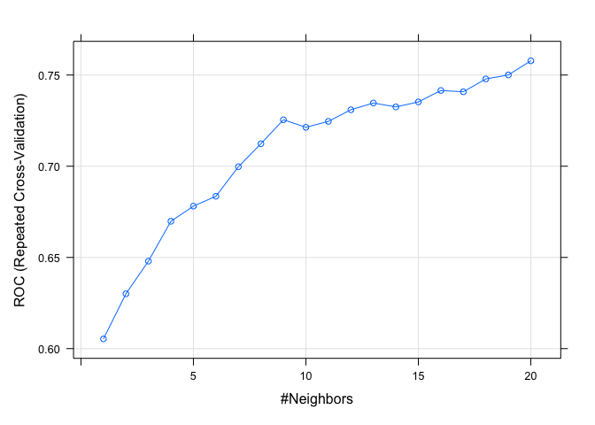
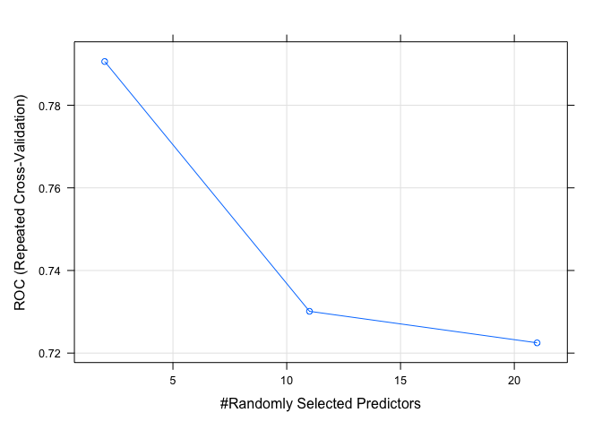

---
title: "Machine Learning I - Classification - Final Report"
author: "Mateusz Domaradzki & Karol Ziolo"
output: 
  html_document:
    toc: true # table of content true
    keep_md: true
    toc_depth: 3  # upto three depths of headings (specified by #, ## and ###)
    toc_float: TRUE
    theme: united
    highlight: tango
---

<br>
<br><br>
<br><br>
<br><br>

# Classification

<br>

## Data Exploration


### General outlook on data

<br>

<font size=4> Let read the data. </font>

```r
data2 = read.csv("drugs_train.csv")
```
<br>

<font size=4> My first step was to check for NAs. </font>


```r
kable(colSums(is.na(data2)) %>% 
  sort())
```


|                               |  x|
|:------------------------------|--:|
|id                             |  0|
|age                            |  0|
|gender                         |  0|
|education                      |  0|
|country                        |  0|
|ethnicity                      |  0|
|personality_neuroticism        |  0|
|personality_extraversion       |  0|
|personality_openness           |  0|
|personality_agreeableness      |  0|
|personality_conscientiousness  |  0|
|personality_impulsiveness      |  0|
|personality_sensation          |  0|
|consumption_alcohol            |  0|
|consumption_amphetamines       |  0|
|consumption_caffeine           |  0|
|consumption_cannabis           |  0|
|consumption_chocolate          |  0|
|consumption_mushrooms          |  0|
|consumption_nicotine           |  0|
|consumption_cocaine_last_month |  0|
<br>

<font size=4> We do not have any NAs thus we can move forward and check which variables are characters. </font>

<br>


```r
kable(sapply(data2, is.character))
```


|                               |x     |
|:------------------------------|:-----|
|id                             |TRUE  |
|age                            |TRUE  |
|gender                         |TRUE  |
|education                      |TRUE  |
|country                        |TRUE  |
|ethnicity                      |TRUE  |
|personality_neuroticism        |FALSE |
|personality_extraversion       |FALSE |
|personality_openness           |FALSE |
|personality_agreeableness      |FALSE |
|personality_conscientiousness  |FALSE |
|personality_impulsiveness      |FALSE |
|personality_sensation          |FALSE |
|consumption_alcohol            |TRUE  |
|consumption_amphetamines       |TRUE  |
|consumption_caffeine           |TRUE  |
|consumption_cannabis           |TRUE  |
|consumption_chocolate          |TRUE  |
|consumption_mushrooms          |TRUE  |
|consumption_nicotine           |TRUE  |
|consumption_cocaine_last_month |TRUE  |

```r
data2 = data2[,-1]
```
<br>

<font size=4> We have noticed that there is an ID column which we decided to drop because it is not valuable for us. </font>

<br>

### Age

<font size=4> As it is presented below people were divided into six age groups. However, we have noticed that its distribution is slightly imbalanced. Thus, we decided to merge groups "55-64" and "65+" into one group called "55+" to be more representative. </font>

<br>


```r
kable(table(data2$age))
```


|Var1  | Freq|
|:-----|----:|
|18-24 |  528|
|25-34 |  375|
|35-44 |  278|
|45-54 |  233|
|55-64 |   72|
|65+   |   14|

```r
data2$age[data2$age=="55-64"] <- "55+"
data2$age[data2$age == "65+"] <- "55+"

data2$age = factor(data2$age, levels = c("18-24",
                                         "25-34",
                                         "35-44",
                                         "45-54",
                                         "55+"),ordered = TRUE)

data2$age <- droplevels(data2$age)
```
### Gender

<font size=4> As of Gender variable we modified it into factors. </font>

<br>


```r
data2$gender = factor(data2$gender, levels = c("male","female"), ordered = TRUE)
```

<br>

### Education

<font size=4> The education variable is divided into many levels, which again is not distributed evenly. We have many disproportions so we decided to merge people who left school at or before 18 into one group. </font>

<br>


```r
kable(table(data2$education))
```


|Var1                                                 | Freq|
|:----------------------------------------------------|----:|
|Doctorate degree                                     |   66|
|Left school at 16 years                              |   72|
|Left school at 17 years                              |   26|
|Left school at 18 years                              |   85|
|Left school before 16 years                          |   20|
|Masters degree                                       |  229|
|Professional certificate/ diploma                    |  221|
|Some college or university, no certificate or degree |  405|
|University degree                                    |  376|

```r
data2$education[data2$education %in% c("Left school before 16 years",
                                       "Left school at 16 years",
                                       "Left school at 17 years",
                                       "Left school at 18 years")] <- "Left school at or before 18"

data2$education = factor(data2$education, levels = c("Left school at or before 18",
                                                     "Some college or university, no certificate or degree",
                                                     "Professional certificate/ diploma",
                                                     "University degree",
                                                     "Masters degree",
                                                     "Doctorate degree"),
                         ordered = TRUE)
data2$education <- droplevels(data2$education)
```

### Country

<font size=4> As for the country variable we have noticed that most people are from Australia or USA. However, there is small number of people from Canada and Ireland so we decided to assign them to the group of others. </font>

<br>


```r
kable(table(data2$country))
```


|Var1        | Freq|
|:-----------|----:|
|Australia   |  460|
|Canada      |    5|
|Ireland     |   13|
|New Zealand |   94|
|Other       |   44|
|UK          |   73|
|USA         |  811|

```r
data2$country[data2$country %in% c("Canada","Ireland")] <- "Other"
```

<br>

### Ethnicity

<font size=4> We checked the Ethnicity variable and we have noticed that sample is practically homogeneous. Thus, we decided to drop it because it does not provide any reliable information regarding other ethnic groups. </font>

<br>


```r
kable(table(data2$ethnicity))
```


|Var1              | Freq|
|:-----------------|----:|
|Asian             |   25|
|Black             |   22|
|Mixed-Black/Asian | 1372|
|Mixed-White/Asian |   15|
|Mixed-White/Black |   47|
|Other             |   16|
|White             |    3|

```r
data2 = data2[,-5]
```

<br>

### Consumption

<font size=4> We believe that variables that concern consumption should be grouped because the frequency split is too broad. It was decided to downgrade it into three groups: "regularly", "occasionally" and "never". We also consider that "Consumption Chocolate" and "Consumption Caffeine" do not have any direct impact whether person consumes cocaine so we decided to drop them from our dataset.  </font>

<br>


```r
# Vector of consumption variables which concern us 
consumption_variables = c("consumption_alcohol", "consumption_amphetamines", 
                          "consumption_cannabis", "consumption_mushrooms", 
                          "consumption_nicotine")
# Grouping function
fun = 
  function(x){
  if (x %in% c("never used","used over a decade ago","used in last decade")){
    x = "never"}
  else if (x %in% c("used in last year","used in last month")){
    x = "occasionally"}
  else if (x %in% c("used in last week","used in last day")){ 
    x = "regularly"}
  }

# Applying grouping function
data2[consumption_variables] = unlist(lapply(data2[consumption_variables], function(y) lapply(y, fun)))

# Modifying into factors
data2[consumption_variables] = lapply(data2[consumption_variables], 
                                     function(x) factor(x, levels = c("never","occasionally","regularly"),ordered = TRUE))

# Dropping "Consumption Chocolate" and "Consumption Caffeine" variables
data2 = data2[,-c(14,16)]
```

<br>

### Personality Variables

<font size=4> Firstly, we decided to check whether personality variables have any outliers. To do that we looked at their ranges. Based on the table below we can establish that we do not have outliers. </font>

<br>


```r
min_max = matrix(1:14,nrow = 7, ncol = 2)
colnames(min_max) = c("Minimum", "Maximum")
rownames(min_max) = names(which(sapply(data2,is.numeric)))
min_max[,1] = apply(data2[names(which(sapply(data2,is.numeric)))],2, min)
min_max[,2] = apply(data2[names(which(sapply(data2,is.numeric)))],2, max)
kable(min_max)
```


|                              | Minimum| Maximum|
|:-----------------------------|-------:|-------:|
|personality_neuroticism       |       0|     100|
|personality_extraversion      |       0|     100|
|personality_openness          |       0|     100|
|personality_agreeableness     |       0|     100|
|personality_conscientiousness |       0|     100|
|personality_impulsiveness     |       0|     100|
|personality_sensation         |       0|     100|

<br>

<font size=4> Knowing the fact that we do not have any irregularities we decided to aggregate this variables and create one called "personality". It aims to present the dominant character traits. The reason behind this decision is that we believe that these variables in continuous form are not reliable because people cannot establish real level of their personality traits. What it might be valuable from that data is its hierarchical order. So, we decided to check which personality trait had the highest score and we assigned it to personality variable. </font>

<br>


```r
data2["personality"] =  
  colnames(data2[sapply(data2,is.numeric)])[apply(data2[sapply(data2,is.numeric)],1,which.max)]

data2$personality = as.factor(data2$personality)
```

<br>

### Dependent Variable

<font size=4>We modified our dependent variable into factor. We also noticed that our dataset is strongly imbalanced. Thus, we decided to use upsampling in our analysis. </font>


```r
kable(table(data2$consumption_cocaine_last_month))
```


|Var1 | Freq|
|:----|----:|
|No   | 1373|
|Yes  |  127|

```r
data2$consumption_cocaine_last_month = factor(data2$consumption_cocaine_last_month, levels = c("No","Yes"), ordered = TRUE)

data2 = data2[sapply(data2,is.factor)]
```

<br>

### Statistical Tests

<font size=4>To verify whether variables has a significant impact on cocaine consumption, we decided to run chi-squred tests. Based on the results we decided to drop the education variable because its p-value exceeded 5%.</font>


```r
chisqr = matrix(1:10,nrow = 10, ncol = 1)
colnames(chisqr) = c("p-value")
rownames(chisqr) = names(which(sapply(data2,is.factor)))
chisqr[,1] = apply(data2[names(which(sapply(data2,is.factor)))],2, 
                   function(x) round(chisq.test(x, data2$consumption_cocaine_last_month,correct=FALSE)$p.value,4))
```

```
## Warning in chisq.test(x, data2$consumption_cocaine_last_month, correct = FALSE):
## Chi-squared approximation may be incorrect
```

```r
kable(chisqr)
```


|                               | p-value|
|:------------------------------|-------:|
|age                            |  0.0000|
|gender                         |  0.0003|
|education                      |  0.0736|
|consumption_alcohol            |  0.0040|
|consumption_amphetamines       |  0.0000|
|consumption_cannabis           |  0.0000|
|consumption_mushrooms          |  0.0000|
|consumption_nicotine           |  0.0000|
|consumption_cocaine_last_month |  0.0000|
|personality                    |  0.0000|

```r
data2 = data2[,-3]
data2$education
```

```
## NULL
```

<br>

## Data Modelling

### Algorithms

<br>

<font size=4> We decided that we are going to try to use 4 algorithms that are presented below: </font>
<br>
<font size=3>
<ul>
  <li>Logistic Regression </li> 
  <li>KNN </li>
  <li>SVM </li>
  <li>Random Forest </li>
</ul> 
</font>

<br>

<font size=4>Each of the presented algorithms has its own benefits and drawbacks and this is the reason why we decided to go with all of them. We wanted to compare them and choose the most accurate for this dataset. </font>

### Cross-Validation

<font size=4>Overfitting is one of the burdensome issue in Machine Learning. As we want to perform as accurate model as possible we needed to minimize that problem, so we decided to apply a Cross Validation procedure. Even though it is computationally expensive, we do not waste too much data which is extremely important in our case. Ultimately, we decided to go with five folds and three repeats. Additionally, as it was previously said, we used upsampling method.</font>


```r
options(contrasts = c("contr.treatment",  # for non-ordinal factors
                      "contr.treatment")) # for ordinal factors
set.seed(9432398) # We specify random seed

# Train control with cross-validation
ctrl_cv5 <- trainControl(method = "repeatedcv",
                         number = 5,
                         classProbs = TRUE,
                         summaryFunction = twoClassSummary,
                         repeats = 3)

ctrl_cv5$sampling = "up"
```

<br>

### Logistic regression

<font size=4> Our first algorithm was logistic regression. We decided start with it because it is easy method to implement, interpret, and very efficient to train. To increase the performance of the model we decided to add some interactions. We believed that the impact of the addictive substances might differ depending on people's character traits. We decided to go with the following variables, cannabis consumption, amphetamines consumption and mushrooms consumption, because they constitute so called soft and hard drugs. Thus, these three variables have been mixed with personality variable. </font>

<br>


```r
data2_logit_train1 <- 
  train(consumption_cocaine_last_month ~ . + personality*consumption_amphetamines 
        + personality*consumption_cannabis + personality*consumption_cannabis,
        data = data2,        
        method = "glm",
        family = "binomial",
        metric = "ROC",
        trControl = ctrl_cv5)
```

```
## Warning: glm.fit: fitted probabilities numerically 0 or 1 occurred

## Warning: glm.fit: fitted probabilities numerically 0 or 1 occurred

## Warning: glm.fit: fitted probabilities numerically 0 or 1 occurred

## Warning: glm.fit: fitted probabilities numerically 0 or 1 occurred

## Warning: glm.fit: fitted probabilities numerically 0 or 1 occurred

## Warning: glm.fit: fitted probabilities numerically 0 or 1 occurred

## Warning: glm.fit: fitted probabilities numerically 0 or 1 occurred

## Warning: glm.fit: fitted probabilities numerically 0 or 1 occurred

## Warning: glm.fit: fitted probabilities numerically 0 or 1 occurred

## Warning: glm.fit: fitted probabilities numerically 0 or 1 occurred
```

```r
data2_logit_train1
```

```
## Generalized Linear Model 
## 
## 1500 samples
##    8 predictor
##    2 classes: 'No', 'Yes' 
## 
## No pre-processing
## Resampling: Cross-Validated (5 fold, repeated 3 times) 
## Summary of sample sizes: 1200, 1200, 1201, 1199, 1200, 1200, ... 
## Addtional sampling using up-sampling
## 
## Resampling results:
## 
##   ROC        Sens       Spec     
##   0.7395105  0.7263959  0.6876923
```

<br>

<font size=4>We compared previous model to one which do not have any interactions to verify whether they improve our results. The results revaled that model do not differ significantly. Thus, we decided to stay with the last one.</font>


```r
data2_logit_train1 <- 
  train(consumption_cocaine_last_month ~ .,
        data = data2,        
        method = "glm",
        family = "binomial",
        metric = "ROC",
        trControl = ctrl_cv5)

data2_logit_train1
```

```
## Generalized Linear Model 
## 
## 1500 samples
##    8 predictor
##    2 classes: 'No', 'Yes' 
## 
## No pre-processing
## Resampling: Cross-Validated (5 fold, repeated 3 times) 
## Summary of sample sizes: 1200, 1199, 1200, 1201, 1200, 1199, ... 
## Addtional sampling using up-sampling
## 
## Resampling results:
## 
##   ROC       Sens       Spec     
##   0.786158  0.7319779  0.7322051
```

<br>

### KNN

<font size=4>One of the biggest advantage of the KNN algorithm is its simplicity. It is quite intuitive method which simply finds K nearest neighbors. Unfortunately, this algorithm is vulnerable to uneven distribution of the explained variable. We believe that upsampling procedure we used might solve that problem.</font>

<br>


```r
k_possible = data.frame(k=seq(1,20,1))

data2_knn_train <- 
  train(consumption_cocaine_last_month ~ .,
        data2,        
        method = "knn",
        metric = "ROC",
        trControl = ctrl_cv5,
        tuneGrid = k_possible,
        preProcess = c("range"))

data2_knn_train
```

```
## k-Nearest Neighbors 
## 
## 1500 samples
##    8 predictor
##    2 classes: 'No', 'Yes' 
## 
## Pre-processing: re-scaling to [0, 1] (21) 
## Resampling: Cross-Validated (5 fold, repeated 3 times) 
## Summary of sample sizes: 1199, 1200, 1201, 1201, 1199, 1201, ... 
## Addtional sampling using up-sampling prior to pre-processing
## 
## Resampling results across tuning parameters:
## 
##   k   ROC        Sens       Spec     
##    1  0.6053419  0.8237293  0.3890256
##    2  0.6300595  0.7542809  0.4944615
##    3  0.6479507  0.7232170  0.5493333
##    4  0.6698190  0.6994231  0.6016410
##    5  0.6781217  0.6863190  0.6334359
##    6  0.6835305  0.6744207  0.6225641
##    7  0.6997335  0.6654413  0.6569231
##    8  0.7123282  0.6579252  0.6777436
##    9  0.7254701  0.6545198  0.6961026
##   10  0.7213490  0.6484380  0.7064615
##   11  0.7245934  0.6518407  0.6987692
##   12  0.7309454  0.6477248  0.7117949
##   13  0.7346690  0.6416607  0.7122051
##   14  0.7325031  0.6474824  0.7090256
##   15  0.7352533  0.6516027  0.7092308
##   16  0.7415237  0.6615519  0.7041026
##   17  0.7408137  0.6518434  0.7146667
##   18  0.7478697  0.6593869  0.7224615
##   19  0.7500525  0.6613068  0.6989744
##   20  0.7578039  0.6683548  0.7381538
## 
## ROC was used to select the optimal model using the largest value.
## The final value used for the model was k = 20.
```

<br>


```r
plot(data2_knn_train)
```

<!-- -->

<br>

<font size=4>Based on the graph it we decided to go with k = 9.</font>

<br>


```r
data2_knn_train$results$k = 9
```

### SVM

<font size=4>The main advantage of SVM algorithm is that we reduce the risk of overfitting. Moreover, the  appropriate kernel function allows to solve any complex problem. However, it also has some disadvantages. Especially, it is difficult to tune proper hyper parameters, cost -C and gamma. We decided to go on with the parameters suggested by algorithm, sigma = 0.03044707 and C = 0.25. </font>


```r
parametersC_sigma2 <- 
  expand.grid(C = c(0.1,0.5,0.1),
              sigma = c(0.01,0.05,0.01))

data2_svm_train <- 
  train(consumption_cocaine_last_month ~ .,
        data2,        
        method = "svmRadial",
        metric = "ROC",
        trControl = ctrl_cv5)
        #tuneGrid = parametersC_sigma2)

data2_svm_train
```

```
## Support Vector Machines with Radial Basis Function Kernel 
## 
## 1500 samples
##    8 predictor
##    2 classes: 'No', 'Yes' 
## 
## No pre-processing
## Resampling: Cross-Validated (5 fold, repeated 3 times) 
## Summary of sample sizes: 1199, 1200, 1201, 1200, 1200, 1199, ... 
## Addtional sampling using up-sampling
## 
## Resampling results across tuning parameters:
## 
##   C     ROC        Sens       Spec     
##   0.25  0.7819312  0.7800451  0.6586667
##   0.50  0.7666103  0.7960770  0.5956923
##   1.00  0.7579168  0.8205884  0.5375385
## 
## Tuning parameter 'sigma' was held constant at a value of 0.03044707
## ROC was used to select the optimal model using the largest value.
## The final values used for the model were sigma = 0.03044707 and C = 0.25.
```

<br>

### Random Forest

<font size=4>Additionally, we decided to try new algorithm that we did not have during our classes which was random forest. This method has a couple of advantages that previous ones did not have. Firstly, it is known that this algorithm is popular due to its accuracy. And this is a main reason why we decided to try it out. We believed that our dataset need precise method because it is imbalanced. Moreover, this method also solves the problem of overfitting. 
The important issue in this algorithm is to select proper number of variables randomly sampled as of candidates for each split. We can notice on the graph below that number two variables are characterized with the highest ROC value.</font>

<br>


```r
data2_rf_train <- 
  train(consumption_cocaine_last_month ~ .,
        data2,        
        method = "rf",
        metric = "ROC",
        trControl = ctrl_cv5)

plot(data2_rf_train)
```

<!-- -->

## Model Evaluation

<font size=4>In order to choose our final model we decided to run predictions on the whole dataset using all algorithms. We used parameters that were selected in our previous steps. We also decided to choose Balanced Accuracy as our final index to evaluate accuracy of our model. </font>


```r
logit_fitted = predict(data2_logit_train1, data2)
logit_results = summary_binary_class(predicted_classes = logit_fitted,
                     real = data2$consumption_cocaine_last_month)

knn_fitted = predict(data2_knn_train, data2)
knn_results = summary_binary_class(predicted_classes = knn_fitted,
                     real = data2$consumption_cocaine_last_month)

svm_fitted = predict(data2_svm_train, data2)
svm_results = summary_binary_class(predicted_classes = svm_fitted,
                     real = data2$consumption_cocaine_last_month)

rf_fitted = predict(data2_rf_train, data2)
rf_results = summary_binary_class(predicted_classes = rf_fitted,
                     real = data2$consumption_cocaine_last_month)

balanced_accuracy  = matrix(1:4, nrow=1, ncol=4)

balanced_accuracy[1,1]=confusionMatrix(as.factor(logit_fitted), data2$consumption_cocaine_last_month)$byClass[11]
balanced_accuracy[1,2]=confusionMatrix(as.factor(knn_fitted), data2$consumption_cocaine_last_month)$byClass[11]
balanced_accuracy[1,3]=confusionMatrix(as.factor(svm_fitted), data2$consumption_cocaine_last_month)$byClass[11]
balanced_accuracy[1,4]=confusionMatrix(as.factor(rf_fitted), data2$consumption_cocaine_last_month)$byClass[11]

colnames(balanced_accuracy) = c("Logit","KNN","SVM","Random Forest")
rownames(balanced_accuracy) = c("Balanced Accuracy")
kable(balanced_accuracy)
```


|                  |     Logit|       KNN|       SVM| Random Forest|
|:-----------------|---------:|---------:|---------:|-------------:|
|Balanced Accuracy | 0.7685854| 0.7515585| 0.8160847|     0.8303961|

```r
print(paste0('The best algorithm for our dataset is ', colnames(balanced_accuracy)[apply(balanced_accuracy,1,which.max)],
             ' with the predicted Balanced Accuracy equals to ', round(balanced_accuracy[apply(balanced_accuracy,1,which.max)]*100,2),'%'))
```

```
## [1] "The best algorithm for our dataset is Random Forest with the predicted Balanced Accuracy equals to 83.04%"
```
