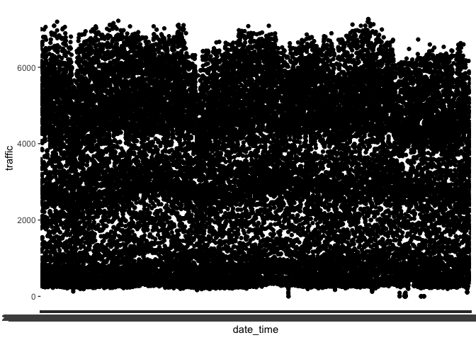
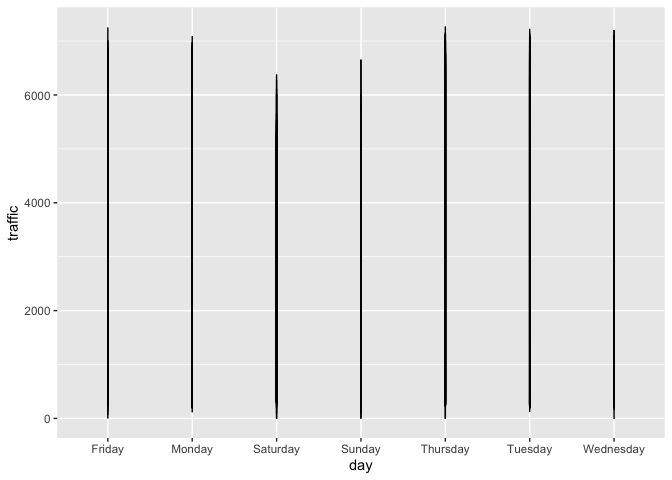
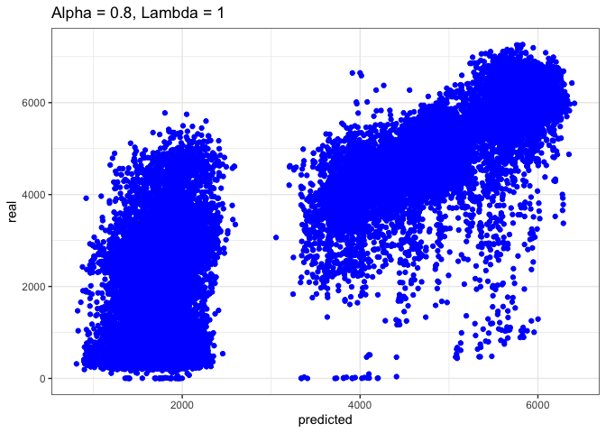
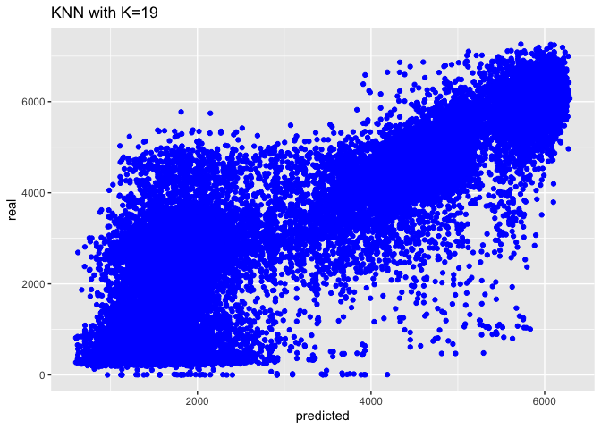
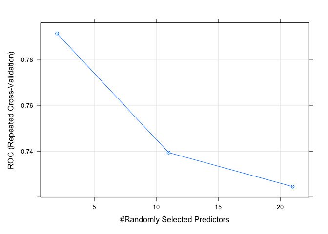

---
title: "Machine Learning I - Regression - Final Raport"
author: "<font size=5><b>- Mateusz Domaradzki & Karol Ziolo</b></font>"
output:
  html_document:
    toc: yes
    keep_md: yes
    toc_depth: 3
    toc_float: yes
    theme: united
    highlight: tango
  pdf_document:
    toc: yes
    toc_depth: '3'
---


<br>
<br><br>
<br><br>
<br><br>


# Regression

<br><br>

## Data Preparation


### General outlook on data

<br>

<font size=4> I read in the data </font>

```r
data <- read.csv("Regression/traffic_train.csv")
```
<br>

<font size=4> I check if there are duplicates or NAs </font>


```r
colSums(is.na(data)) %>% 
  sort()
```

```
##           date_time     weather_general    weather_detailed clouds_coverage_pct 
##                   0                   0                   0                   0 
##         temperature             rain_mm             snow_mm             traffic 
##                   0                   0                   0                   0
```

```r
data[which(duplicated(data)),]
```

```
##                 date_time weather_general weather_detailed clouds_coverage_pct
## 28795 2018-12-02 09:00:00            Mist             mist                  90
## 28796 2018-12-02 09:00:00            Snow       light snow                  90
##       temperature rain_mm snow_mm traffic
## 28795         0.6       0       0    2331
## 28796         0.6       0       0    2334
```
<br>

<font size=4> Not really so we can move forward and check pattern in time </font>

<br>
<!-- -->
<br>


### Time preparation

<font size=4> I extract the most interesting part of date-time </font>

<br>

```r
data$date_time <- as.POSIXct(data$date_time, format = "%Y-%m-%d %H:%M:%S")
yq <- as.yearqtr(data$date_time, format = "%Y-%m-%d %H:%M:%S")
data$kwartal<-format(yq, format = "%q")
data$hour<-format(data$date_time, format='%H')
data$hour<-as.numeric(data$hour)

data$month<-format(data$date_time, format='%m')
data$day<-weekdays(data$date_time)
```


<br>

<font size=4> I apply a function to transform hours to parts of the day according to the plot given below. It's also logical and even based in life that people are trying to commute to home in different hours. The best feeling is driving a car in an empty city at 3 am<font/>


```r
time_of_the_day<-function(x) {
  result<-list()
  if(x>=6 & x<=8){
    result<-"Traffic_morning_peak_hour"
  } 
  else if(x>8 & x<15){
    result<-"Working_hours"}
  else if(x>=15 & x<=17){
    result<-"Traffic_evening_peak_hour"}
  else{
    result <-"night"}
  return(result)
}
```

<!-- -->
<br>
<br>
<font size=4> let's apply the function </font>

```r
data$hour2<-lapply(data$hour,time_of_the_day)
data$hour2<-as.character(data$hour2)
data$hour2<-as.factor(data$hour2)
```
<br>

### Weather preparation

<br>
<font size=4> I have to admit that we decided to not use this more rich in description weather column because
we saw many things that we have to merge and diversity provided in weather_general is good enough to judge
what should happen with the traffic. At all not every weather state should affect traffic so we just drop it 
instantly </font>
<br>


```r
kable(table(data$weather_general)) %>%
  sort(decreasing = FALSE)
```

```
##  [1] "|:------------|-----:|" "|Clear        |  8030|" "|Clouds       | 10163|"
##  [4] "|Drizzle      |   919|" "|Fog          |   481|" "|Haze         |   743|"
##  [7] "|Mist         |  3491|" "|Rain         |  3559|" "|Smoke        |    17|"
## [10] "|Snow         |  1794|" "|Squall       |     4|" "|Thunderstorm |   497|"
## [13] "|Var1         |  Freq|"
```

<br>

<font size=4> I decided to merge some of them because logicaly there are the same and should not affect our traffic. 
Of course we can check if the values are different by filtering the data but it may results in overfitting the model.
Let's keep it simple </font>

<br>

<font size=4> Things that should be merged in my opinion:
<ult>
<li> Merge fog and mist </li>
<li> Smoke and Haze </li>
<li> Squall and Thunderstorm </li>
</ult>
<br>


```r
data$weather_general <- as.factor(data$weather_general)

data$weather_general[data$weather_general == "Maze"] <- "Fog"
data$weather_general[data$weather_general == "Haze"] <- "Smoke"
data$weather_general[data$weather_general == "Squall"] <- "Thunderstorm"

data$weather_general <- droplevels(data$weather_general)
kable(table(data$weather_general))
```


|Var1         |  Freq|
|:------------|-----:|
|Clear        |  8030|
|Clouds       | 10163|
|Drizzle      |   919|
|Fog          |   481|
|Mist         |  3491|
|Rain         |  3559|
|Smoke        |   760|
|Snow         |  1794|
|Thunderstorm |   501|
<br>

<font size=4> We won't also use snow nor rain because those things are pretty always equal to 0 </font>


```r
kable(head(table(data$snow_mm),10))
```


|Var1 |  Freq|
|:----|-----:|
|0    | 29635|
|0.05 |    14|
|0.06 |    12|
|0.08 |     2|
|0.1  |     6|
|0.13 |     6|
|0.17 |     3|
|0.21 |     1|
|0.25 |     6|
|0.32 |     5|

```r
kable(head(table(data$rain_mm),10))
```


|Var1 |  Freq|
|:----|-----:|
|0    | 26944|
|0.25 |   679|
|0.26 |     2|
|0.27 |     5|
|0.28 |    19|
|0.29 |     4|
|0.3  |   119|
|0.31 |     2|
|0.32 |    12|
|0.33 |     1|

<br>

<font size=4> Lets check temperature </font>

<br> 

```r
kable(head(table(data$temperature),10))
```


|Var1   | Freq|
|:------|----:|
|-273.1 |   10|
|-29.8  |    1|
|-29.5  |    1|
|-28.9  |    1|
|-28.3  |    4|
|-27.5  |    1|
|-27.4  |    3|
|-27.1  |    1|
|-27    |    1|
|-26.9  |    1|

```r
data<-data[-c(which(data$temperature==-273.1)),]
data<-data[-c(which(data$rain_mm>100)),]
```
<br>

<font size=4> Data seems to be various but we have some outliers (at least I dont believe that we can achieve -273.1.
Also I dropped an outlier from rain (I believe that is an ouliter) </font>

<br>

### Feature selection

<br>

<font size = 4> We also need to check if the data is at least correlated to traffic </font>


|                    | clouds_coverage_pct| temperature|    rain_mm|    snow_mm|    traffic|       hour|
|:-------------------|-------------------:|-----------:|----------:|----------:|----------:|----------:|
|clouds_coverage_pct |           1.0000000|  -0.1703894|  0.0886892|  0.0351593|  0.0393405|  0.0179547|
|temperature         |          -0.1703894|   1.0000000|  0.1027189| -0.0250283|  0.1344646|  0.1109590|
|rain_mm             |           0.0886892|   0.1027189|  1.0000000|  0.0002111| -0.0302496| -0.0183159|
|snow_mm             |           0.0351593|  -0.0250283|  0.0002111|  1.0000000|  0.0014836|  0.0124746|
|traffic             |           0.0393405|   0.1344646| -0.0302496|  0.0014836|  1.0000000|  0.3479256|
|hour                |           0.0179547|   0.1109590| -0.0183159|  0.0124746|  0.3479256|  1.0000000|
<br>
<font size=4> Now im sure that I won't use nor rain nor snow nor covarage </font>
<br>

<font size=4> Also ANOVA for categorical values </font>

<br>

|                |           x|
|:---------------|-----------:|
|hour2           | 13162.71036|
|weather_general |    49.88013|
<br>

<font size=4> A lot of can be improved </font>

<br>

<font szie=4> some ggplots to improve dataset </font>

<br>

<!-- -->

<br>

<!-- -->

<br>

<font size=4> By that we will create 2 functions to divide months and days into useful parts </font>


```r
season_of_the_year <- function(x) {
  result<-list()
  if(x=='11' || x=='12' || x=='01'){
    result<-"Winter"
  } 
  else if(x=='07' || x=='08' || x=='09' ){
    result<-"Summer_Holidays"}
  else{
    result <-"The_Rest_of_the_season"}
  return(result)
}

day_of_the_wk<- function(x) {
  result<-list()
  if(language == "ENG"){
    if(x=='Saturday' || x=='Sunday'){
      result<-"Weekend"
    } 
    else{
      result <-"Working_day"}
    return(result)
  }
  else{
    if(x=='sobota' || x=='niedziela'){
      result<-"Weekend"
    } 
    else{
      result <-"Working_day"}
    return(result)
  }
}

data$season<-lapply(data$month,season_of_the_year)
data$season<-as.character(data$season)
data$season<-as.factor(data$season)

data$day2<-lapply(data$day, day_of_the_wk)
data$day2<-as.character(data$day2)
data$day2<-as.factor(data$day2)
```

<br>
<font size=4> last ANOVA to check if we are in a better position </font>


|                |           x|
|:---------------|-----------:|
|hour2           | 13162.71036|
|day2            |  1596.66607|
|season          |    60.38177|
|weather_general |    49.88013|
<br>

<font size=4> That's seems like a success so I go to proceed some algorithms</font>

<br>

<font size=4> Our final dataset: </font>


```r
data_final<-data[,c(8,2,5,13,14,15)]
kable(head(data_final,20))
```


| traffic|weather_general | temperature|hour2                     |season                 |day2        |
|-------:|:---------------|-----------:|:-------------------------|:----------------------|:-----------|
|     508|Clear           |        11.5|night                     |The_Rest_of_the_season |Working_day |
|     323|Clear           |        10.3|night                     |The_Rest_of_the_season |Working_day |
|     274|Clear           |         8.0|night                     |The_Rest_of_the_season |Working_day |
|     372|Clear           |         7.9|night                     |The_Rest_of_the_season |Working_day |
|     812|Clear           |         6.4|night                     |The_Rest_of_the_season |Working_day |
|    2720|Clear           |         5.5|night                     |The_Rest_of_the_season |Working_day |
|    5674|Clear           |         5.1|Traffic_morning_peak_hour |The_Rest_of_the_season |Working_day |
|    6512|Clear           |         5.0|Traffic_morning_peak_hour |The_Rest_of_the_season |Working_day |
|    5473|Clear           |         9.3|Working_hours             |The_Rest_of_the_season |Working_day |
|    5096|Clear           |        18.8|Working_hours             |The_Rest_of_the_season |Working_day |
|    4887|Clear           |        20.1|Working_hours             |The_Rest_of_the_season |Working_day |
|    5335|Clear           |        21.2|Working_hours             |The_Rest_of_the_season |Working_day |
|    5699|Clear           |        22.0|Traffic_evening_peak_hour |The_Rest_of_the_season |Working_day |
|    6130|Clear           |        22.0|Traffic_evening_peak_hour |The_Rest_of_the_season |Working_day |
|    4620|Clouds          |        20.5|night                     |The_Rest_of_the_season |Working_day |
|    3594|Clouds          |        17.5|night                     |The_Rest_of_the_season |Working_day |
|    2895|Clouds          |        15.0|night                     |The_Rest_of_the_season |Working_day |
|    2643|Clear           |        14.0|night                     |The_Rest_of_the_season |Working_day |
|    1783|Clear           |        13.1|night                     |The_Rest_of_the_season |Working_day |
|    1017|Clear           |        12.1|night                     |The_Rest_of_the_season |Working_day |
<br>

<font size=4> But let's exclude a 10% validation sample just to be sure that at the end we can go with the right algorithm</font>


```r
X<-sample(seq(1:29687), 3000)

data_validation <- data_final[X,]

data_final<-data_final[-X, ]
```

<br>


## Algorithms

<br>

<font size=5> We decided that we are going to try to use more or less those 5 algorithms </font>
<br>
<font size=4>
<ul>
  <li>OLS </li> 
  <li>LASSO </li>
  <li>RIDGE </li>
  <li>Elastic approach between them </li>
  <li>KNN </li>
  <li>SVR </li>
</ul> 
</font>

<br>

<font size=4><b>Due to computational issues I decided to present only final parameteres for every selected algorithm.
I checked a range values of K for KNN etc but including for example more possibilities for SVR would kill my computer </b> </font>

<br>

<font size=4> We will try to check both ends, I mean high variance and low bias plus low variance and high bias then we will use linear regression + Lasso/Ridge. Then we have two imporant efficient algorithms KNN which is one of the most optimal accoring to books and SVR which is also very sufficient especially if we have weird combinations in dataset </font>

<br>

### Linear regression

<br>

<font size=4> setting the right options </font


```r
options(contrasts = c("contr.treatment",  # for non-ordinal factors
                      "contr.treatment")) # for ordinal factors
```

<br>

<font size=4> I will try 2 models, one clear and one with interactions between variables. 
I've been doing some experiments with them and which are the best so below I will show
only the best interactions I could find and that are logical for me </font>

<br>


```r
#model without interactions
traffic_lm <- lm(traffic~. -1, 
                 data = data_final) 

summary(traffic_lm)
```

```
## 
## Call:
## lm(formula = traffic ~ . - 1, data = data_final)
## 
## Residuals:
##     Min      1Q  Median      3Q     Max 
## -4810.8  -784.2    61.4   766.9  4303.9 
## 
## Coefficients:
##                                 Estimate Std. Error t value Pr(>|t|)    
## weather_generalClear            746.1244    27.2764  27.354  < 2e-16 ***
## weather_generalClouds           813.6233    28.3101  28.740  < 2e-16 ***
## weather_generalDrizzle          665.0904    49.4103  13.461  < 2e-16 ***
## weather_generalFog              327.7719    62.8370   5.216 1.84e-07 ***
## weather_generalMist             508.0755    33.5819  15.129  < 2e-16 ***
## weather_generalRain             645.8075    33.7547  19.132  < 2e-16 ***
## weather_generalSmoke            794.7841    52.8165  15.048  < 2e-16 ***
## weather_generalSnow             620.6633    39.5556  15.691  < 2e-16 ***
## weather_generalThunderstorm     514.7552    62.8627   8.189 2.76e-16 ***
## temperature                      18.8783     0.8361  22.580  < 2e-16 ***
## hour2Traffic_evening_peak_hour 3513.2190    23.7214 148.103  < 2e-16 ***
## hour2Traffic_morning_peak_hour 2749.1860    22.9651 119.711  < 2e-16 ***
## hour2Working_hours             2740.1159    18.1512 150.961  < 2e-16 ***
## seasonThe_Rest_of_the_season    304.8850    21.2195  14.368  < 2e-16 ***
## seasonWinter                    236.8006    28.7763   8.229  < 2e-16 ***
## day2Working_day                 995.5320    16.2238  61.362  < 2e-16 ***
## ---
## Signif. codes:  0 '***' 0.001 '**' 0.01 '*' 0.05 '.' 0.1 ' ' 1
## 
## Residual standard error: 1196 on 26671 degrees of freedom
## Multiple R-squared:  0.9006,	Adjusted R-squared:  0.9006 
## F-statistic: 1.511e+04 on 16 and 26671 DF,  p-value: < 2.2e-16
```

```r
#model with interactions
traffic_lm2 <- lm(traffic~. + weather_general*hour2  + day2*hour2 + weather_general*day2 -1, # best formula
                 data = data_final)
summary(traffic_lm2)
```

```
## 
## Call:
## lm(formula = traffic ~ . + weather_general * hour2 + day2 * hour2 + 
##     weather_general * day2 - 1, data = data_final)
## 
## Residuals:
##     Min      1Q  Median      3Q     Max 
## -4997.2  -761.8    16.9   650.5  3963.7 
## 
## Coefficients:
##                                                             Estimate Std. Error
## weather_generalClear                                       1396.9980    31.4830
## weather_generalClouds                                      1530.6529    32.5242
## weather_generalDrizzle                                     1292.8130    82.8706
## weather_generalFog                                          695.6982   101.2317
## weather_generalMist                                         937.8015    45.1536
## weather_generalRain                                        1231.8315    46.2014
## weather_generalSmoke                                       1269.4729    95.0391
## weather_generalSnow                                        1359.6179    61.6768
## weather_generalThunderstorm                                 879.8407    94.0524
## temperature                                                  18.8007     0.7397
## hour2Traffic_evening_peak_hour                             2469.8485    52.1883
## hour2Traffic_morning_peak_hour                               74.9808    50.7867
## hour2Working_hours                                         2209.2827    39.6535
## seasonThe_Rest_of_the_season                                308.2575    18.6657
## seasonWinter                                                232.1615    25.3285
## day2Working_day                                              78.9157    29.9444
## weather_generalClouds:hour2Traffic_evening_peak_hour       -111.1330    52.4445
## weather_generalDrizzle:hour2Traffic_evening_peak_hour       194.0739   120.6474
## weather_generalFog:hour2Traffic_evening_peak_hour          -162.7847   249.2117
## weather_generalMist:hour2Traffic_evening_peak_hour          262.3229    86.5664
## weather_generalRain:hour2Traffic_evening_peak_hour           64.9408    70.8791
## weather_generalSmoke:hour2Traffic_evening_peak_hour        -164.1396   128.9159
## weather_generalSnow:hour2Traffic_evening_peak_hour         -130.3843    96.7183
## weather_generalThunderstorm:hour2Traffic_evening_peak_hour -105.9893   181.5849
## weather_generalClouds:hour2Traffic_morning_peak_hour       -203.1077    54.6758
## weather_generalDrizzle:hour2Traffic_morning_peak_hour       -53.6593   116.0989
## weather_generalFog:hour2Traffic_morning_peak_hour           529.9704   126.1976
## weather_generalMist:hour2Traffic_morning_peak_hour          264.5776    63.8086
## weather_generalRain:hour2Traffic_morning_peak_hour          -51.9880    71.0810
## weather_generalSmoke:hour2Traffic_morning_peak_hour        -249.8875   154.7868
## weather_generalSnow:hour2Traffic_morning_peak_hour         -274.6542    90.2920
## weather_generalThunderstorm:hour2Traffic_morning_peak_hour   46.6027   151.7254
## weather_generalClouds:hour2Working_hours                   -143.5431    40.8571
## weather_generalDrizzle:hour2Working_hours                    68.7116    97.0005
## weather_generalFog:hour2Working_hours                       384.1721   150.1053
## weather_generalMist:hour2Working_hours                      234.9519    57.7685
## weather_generalRain:hour2Working_hours                       37.8863    55.3514
## weather_generalSmoke:hour2Working_hours                    -226.2385    98.3480
## weather_generalSnow:hour2Working_hours                        5.1220    69.5008
## weather_generalThunderstorm:hour2Working_hours             -217.7696   141.4485
## hour2Traffic_evening_peak_hour:day2Working_day             1478.8675    45.5996
## hour2Traffic_morning_peak_hour:day2Working_day             3820.3935    44.3236
## hour2Working_hours:day2Working_day                          765.9378    35.2908
## weather_generalClouds:day2Working_day                         0.6418    36.6635
## weather_generalDrizzle:day2Working_day                      -11.1605    85.8680
## weather_generalFog:day2Working_day                           87.6356   112.8682
## weather_generalMist:day2Working_day                         134.5807    49.5886
## weather_generalRain:day2Working_day                          78.6117    49.6671
## weather_generalSmoke:day2Working_day                        447.3573    93.8284
## weather_generalSnow:day2Working_day                         -31.8535    65.4521
## weather_generalThunderstorm:day2Working_day                 450.2128   108.5297
##                                                            t value Pr(>|t|)    
## weather_generalClear                                        44.373  < 2e-16 ***
## weather_generalClouds                                       47.062  < 2e-16 ***
## weather_generalDrizzle                                      15.600  < 2e-16 ***
## weather_generalFog                                           6.872 6.45e-12 ***
## weather_generalMist                                         20.769  < 2e-16 ***
## weather_generalRain                                         26.662  < 2e-16 ***
## weather_generalSmoke                                        13.357  < 2e-16 ***
## weather_generalSnow                                         22.044  < 2e-16 ***
## weather_generalThunderstorm                                  9.355  < 2e-16 ***
## temperature                                                 25.418  < 2e-16 ***
## hour2Traffic_evening_peak_hour                              47.326  < 2e-16 ***
## hour2Traffic_morning_peak_hour                               1.476 0.139852    
## hour2Working_hours                                          55.715  < 2e-16 ***
## seasonThe_Rest_of_the_season                                16.515  < 2e-16 ***
## seasonWinter                                                 9.166  < 2e-16 ***
## day2Working_day                                              2.635 0.008408 ** 
## weather_generalClouds:hour2Traffic_evening_peak_hour        -2.119 0.034095 *  
## weather_generalDrizzle:hour2Traffic_evening_peak_hour        1.609 0.107715    
## weather_generalFog:hour2Traffic_evening_peak_hour           -0.653 0.513634    
## weather_generalMist:hour2Traffic_evening_peak_hour           3.030 0.002445 ** 
## weather_generalRain:hour2Traffic_evening_peak_hour           0.916 0.359561    
## weather_generalSmoke:hour2Traffic_evening_peak_hour         -1.273 0.202948    
## weather_generalSnow:hour2Traffic_evening_peak_hour          -1.348 0.177643    
## weather_generalThunderstorm:hour2Traffic_evening_peak_hour  -0.584 0.559434    
## weather_generalClouds:hour2Traffic_morning_peak_hour        -3.715 0.000204 ***
## weather_generalDrizzle:hour2Traffic_morning_peak_hour       -0.462 0.643952    
## weather_generalFog:hour2Traffic_morning_peak_hour            4.200 2.68e-05 ***
## weather_generalMist:hour2Traffic_morning_peak_hour           4.146 3.39e-05 ***
## weather_generalRain:hour2Traffic_morning_peak_hour          -0.731 0.464547    
## weather_generalSmoke:hour2Traffic_morning_peak_hour         -1.614 0.106453    
## weather_generalSnow:hour2Traffic_morning_peak_hour          -3.042 0.002354 ** 
## weather_generalThunderstorm:hour2Traffic_morning_peak_hour   0.307 0.758731    
## weather_generalClouds:hour2Working_hours                    -3.513 0.000443 ***
## weather_generalDrizzle:hour2Working_hours                    0.708 0.478726    
## weather_generalFog:hour2Working_hours                        2.559 0.010492 *  
## weather_generalMist:hour2Working_hours                       4.067 4.77e-05 ***
## weather_generalRain:hour2Working_hours                       0.684 0.493685    
## weather_generalSmoke:hour2Working_hours                     -2.300 0.021434 *  
## weather_generalSnow:hour2Working_hours                       0.074 0.941252    
## weather_generalThunderstorm:hour2Working_hours              -1.540 0.123678    
## hour2Traffic_evening_peak_hour:day2Working_day              32.432  < 2e-16 ***
## hour2Traffic_morning_peak_hour:day2Working_day              86.193  < 2e-16 ***
## hour2Working_hours:day2Working_day                          21.704  < 2e-16 ***
## weather_generalClouds:day2Working_day                        0.018 0.986035    
## weather_generalDrizzle:day2Working_day                      -0.130 0.896589    
## weather_generalFog:day2Working_day                           0.776 0.437495    
## weather_generalMist:day2Working_day                          2.714 0.006653 ** 
## weather_generalRain:day2Working_day                          1.583 0.113485    
## weather_generalSmoke:day2Working_day                         4.768 1.87e-06 ***
## weather_generalSnow:day2Working_day                         -0.487 0.626497    
## weather_generalThunderstorm:day2Working_day                  4.148 3.36e-05 ***
## ---
## Signif. codes:  0 '***' 0.001 '**' 0.01 '*' 0.05 '.' 0.1 ' ' 1
## 
## Residual standard error: 1050 on 26636 degrees of freedom
## Multiple R-squared:  0.9235,	Adjusted R-squared:  0.9233 
## F-statistic:  6302 on 51 and 26636 DF,  p-value: < 2.2e-16
```

```r
traffic_predicted <- predict(traffic_lm)
traffic_predicted2 <- predict(traffic_lm2)
```

<br>

<font size=4> let's plot real vs predicted values </font>

<br>


### Lasso/Ridge/Elastic approach

<br>
<font size=4> The good thing about lasso/Ridge is that we can apply both of them to erase non important values 
and set aplha at a certain level to chose which one we would love to use. This method is at the other
end of bias/variance trade plot </font>

<br>

#### Ridge

<font size=4> lets start with ridge regression </font>
<br>


```r
ctrl_cv5 <- trainControl(method = "cv",
                         number = 5) ## cross-validation


parameters_ridge <- expand.grid(alpha = 0,
                                lambda = seq(0, 1e3, 1))

traffic_ridge <- train(traffic~. + weather_general*hour2  + day2*hour2 + weather_general*day2 -1,
                       data = data_final,
                       method = "glmnet", 
                       tuneGrid = parameters_ridge,
                       trControl = ctrl_cv5)

traffic_ridge$bestTune
```

```
##    alpha lambda
## 80     0     79
```

<br>
<font size=4> Lamba is equals 79 so really close to the linear regression. Lets check LASSO -> RMSE about 1740 </font>
<br>


```r
parameters_lasso <- expand.grid(alpha = 1,
                                lambda = seq(1, 1e4, 10))

traffic_lasso<- train(traffic~. + weather_general*hour2  + day2*hour2 + weather_general*day2 -1,
                      data = data_final,
                      method = "glmnet", 
                      tuneGrid = parameters_lasso,
                      trControl = ctrl_cv5)
```

```
## Warning in nominalTrainWorkflow(x = x, y = y, wts = weights, info = trainInfo, :
## There were missing values in resampled performance measures.
```

```r
traffic_lasso$bestTune
```

```
##   alpha lambda
## 1     1      1
```

<br>

<font size=4> lambda and alfa equals to 1, very interesting to be honest </font>

<br>

<font size=4> Let's check the elastic approach in Alpha </font>

<br>

<font size=4> I experimented some with this algorithm to check between which values of lambada/alpha I should choose.
Do thousands or houndreds are required? Not really, the best set is with lambda between 0 and 10 with alpha around 0.8 </font>


```r
set.seed(2137) ## Let's set seed because lambda and alfa may vary but there are both really similar, just to keep it constant
parameters_elastic2 <- expand.grid(alpha = seq(0, 1, 0.2), 
                                   lambda = seq(0, 10, 0.1))

traffic_elastic <- train(traffic~. + weather_general*hour2  + day2*hour2 + weather_general*day2,
                         data = data_final,
                         method = "glmnet", 
                         tuneGrid = parameters_elastic2,
                         trControl = ctrl_cv5)


traffic_elastic$bestTune
```

```
##     alpha lambda
## 317   0.6    1.3
```

<br>

<font size=4> So we may be quite sure that between those 3 algorithms we are going to the next point with an elastic approach
and alpha=0.2 with lambda = 2 </font>

<br>

<!-- -->

<br>

### KNN

<br>
<font size=4> I decided to use this algorithm because in my books on Machine Learning they say this algorithm may be the
most accurate one in many cases. What I mean, we don't really use any presumptions and we only
match something because of neighbours. In this case, when it's hard for my data to fit in any
kind of regression that assume for example normal distribution, or try to fit to data any coefficients
this one may be really relevant player. We will see at the end in the comparison! </font>

<br>

<font size=4> Once again i experimented between different values of K for KNN and I decided to go with 19 </font>


```r
ctrl_cv5 <- trainControl(method = "cv",
                         number = 5)

k_possible <-data.frame(k=19) ## The value 19 is the best for our dataset so im gonna go with it

traffic_knn <- 
  train(traffic~. + weather_general*hour2  + day2*hour2 + weather_general*day2, 
        data = data_final,
        method = "knn",
        trControl = ctrl_cv5,
        tuneGrid = k_possible,
        preProcess = c("range"))

## k=19 is the lowest RMSE we can obtain, So I will go with that.
```

<br>

<font size=4> let's plot it </font>


```
## List of 93
##  $ line                      :List of 6
##   ..$ colour       : chr "black"
##   ..$ size         : num 0.5
##   ..$ linetype     : num 1
##   ..$ lineend      : chr "butt"
##   ..$ arrow        : logi FALSE
##   ..$ inherit.blank: logi TRUE
##   ..- attr(*, "class")= chr [1:2] "element_line" "element"
##  $ rect                      :List of 5
##   ..$ fill         : chr "white"
##   ..$ colour       : chr "black"
##   ..$ size         : num 0.5
##   ..$ linetype     : num 1
##   ..$ inherit.blank: logi TRUE
##   ..- attr(*, "class")= chr [1:2] "element_rect" "element"
##  $ text                      :List of 11
##   ..$ family       : chr ""
##   ..$ face         : chr "plain"
##   ..$ colour       : chr "black"
##   ..$ size         : num 11
##   ..$ hjust        : num 0.5
##   ..$ vjust        : num 0.5
##   ..$ angle        : num 0
##   ..$ lineheight   : num 0.9
##   ..$ margin       : 'margin' num [1:4] 0points 0points 0points 0points
##   .. ..- attr(*, "unit")= int 8
##   ..$ debug        : logi FALSE
##   ..$ inherit.blank: logi TRUE
##   ..- attr(*, "class")= chr [1:2] "element_text" "element"
##  $ title                     : NULL
##  $ aspect.ratio              : NULL
##  $ axis.title                : NULL
##  $ axis.title.x              :List of 11
##   ..$ family       : NULL
##   ..$ face         : NULL
##   ..$ colour       : NULL
##   ..$ size         : NULL
##   ..$ hjust        : NULL
##   ..$ vjust        : num 1
##   ..$ angle        : NULL
##   ..$ lineheight   : NULL
##   ..$ margin       : 'margin' num [1:4] 2.75points 0points 0points 0points
##   .. ..- attr(*, "unit")= int 8
##   ..$ debug        : NULL
##   ..$ inherit.blank: logi TRUE
##   ..- attr(*, "class")= chr [1:2] "element_text" "element"
##  $ axis.title.x.top          :List of 11
##   ..$ family       : NULL
##   ..$ face         : NULL
##   ..$ colour       : NULL
##   ..$ size         : NULL
##   ..$ hjust        : NULL
##   ..$ vjust        : num 0
##   ..$ angle        : NULL
##   ..$ lineheight   : NULL
##   ..$ margin       : 'margin' num [1:4] 0points 0points 2.75points 0points
##   .. ..- attr(*, "unit")= int 8
##   ..$ debug        : NULL
##   ..$ inherit.blank: logi TRUE
##   ..- attr(*, "class")= chr [1:2] "element_text" "element"
##  $ axis.title.x.bottom       : NULL
##  $ axis.title.y              :List of 11
##   ..$ family       : NULL
##   ..$ face         : NULL
##   ..$ colour       : NULL
##   ..$ size         : NULL
##   ..$ hjust        : NULL
##   ..$ vjust        : num 1
##   ..$ angle        : num 90
##   ..$ lineheight   : NULL
##   ..$ margin       : 'margin' num [1:4] 0points 2.75points 0points 0points
##   .. ..- attr(*, "unit")= int 8
##   ..$ debug        : NULL
##   ..$ inherit.blank: logi TRUE
##   ..- attr(*, "class")= chr [1:2] "element_text" "element"
##  $ axis.title.y.left         : NULL
##  $ axis.title.y.right        :List of 11
##   ..$ family       : NULL
##   ..$ face         : NULL
##   ..$ colour       : NULL
##   ..$ size         : NULL
##   ..$ hjust        : NULL
##   ..$ vjust        : num 0
##   ..$ angle        : num -90
##   ..$ lineheight   : NULL
##   ..$ margin       : 'margin' num [1:4] 0points 0points 0points 2.75points
##   .. ..- attr(*, "unit")= int 8
##   ..$ debug        : NULL
##   ..$ inherit.blank: logi TRUE
##   ..- attr(*, "class")= chr [1:2] "element_text" "element"
##  $ axis.text                 :List of 11
##   ..$ family       : NULL
##   ..$ face         : NULL
##   ..$ colour       : chr "grey30"
##   ..$ size         : 'rel' num 0.8
##   ..$ hjust        : NULL
##   ..$ vjust        : NULL
##   ..$ angle        : NULL
##   ..$ lineheight   : NULL
##   ..$ margin       : NULL
##   ..$ debug        : NULL
##   ..$ inherit.blank: logi TRUE
##   ..- attr(*, "class")= chr [1:2] "element_text" "element"
##  $ axis.text.x               :List of 11
##   ..$ family       : NULL
##   ..$ face         : NULL
##   ..$ colour       : NULL
##   ..$ size         : NULL
##   ..$ hjust        : NULL
##   ..$ vjust        : num 1
##   ..$ angle        : NULL
##   ..$ lineheight   : NULL
##   ..$ margin       : 'margin' num [1:4] 2.2points 0points 0points 0points
##   .. ..- attr(*, "unit")= int 8
##   ..$ debug        : NULL
##   ..$ inherit.blank: logi TRUE
##   ..- attr(*, "class")= chr [1:2] "element_text" "element"
##  $ axis.text.x.top           :List of 11
##   ..$ family       : NULL
##   ..$ face         : NULL
##   ..$ colour       : NULL
##   ..$ size         : NULL
##   ..$ hjust        : NULL
##   ..$ vjust        : num 0
##   ..$ angle        : NULL
##   ..$ lineheight   : NULL
##   ..$ margin       : 'margin' num [1:4] 0points 0points 2.2points 0points
##   .. ..- attr(*, "unit")= int 8
##   ..$ debug        : NULL
##   ..$ inherit.blank: logi TRUE
##   ..- attr(*, "class")= chr [1:2] "element_text" "element"
##  $ axis.text.x.bottom        : NULL
##  $ axis.text.y               :List of 11
##   ..$ family       : NULL
##   ..$ face         : NULL
##   ..$ colour       : NULL
##   ..$ size         : NULL
##   ..$ hjust        : num 1
##   ..$ vjust        : NULL
##   ..$ angle        : NULL
##   ..$ lineheight   : NULL
##   ..$ margin       : 'margin' num [1:4] 0points 2.2points 0points 0points
##   .. ..- attr(*, "unit")= int 8
##   ..$ debug        : NULL
##   ..$ inherit.blank: logi TRUE
##   ..- attr(*, "class")= chr [1:2] "element_text" "element"
##  $ axis.text.y.left          : NULL
##  $ axis.text.y.right         :List of 11
##   ..$ family       : NULL
##   ..$ face         : NULL
##   ..$ colour       : NULL
##   ..$ size         : NULL
##   ..$ hjust        : num 0
##   ..$ vjust        : NULL
##   ..$ angle        : NULL
##   ..$ lineheight   : NULL
##   ..$ margin       : 'margin' num [1:4] 0points 0points 0points 2.2points
##   .. ..- attr(*, "unit")= int 8
##   ..$ debug        : NULL
##   ..$ inherit.blank: logi TRUE
##   ..- attr(*, "class")= chr [1:2] "element_text" "element"
##  $ axis.ticks                :List of 6
##   ..$ colour       : chr "grey20"
##   ..$ size         : NULL
##   ..$ linetype     : NULL
##   ..$ lineend      : NULL
##   ..$ arrow        : logi FALSE
##   ..$ inherit.blank: logi TRUE
##   ..- attr(*, "class")= chr [1:2] "element_line" "element"
##  $ axis.ticks.x              : NULL
##  $ axis.ticks.x.top          : NULL
##  $ axis.ticks.x.bottom       : NULL
##  $ axis.ticks.y              : NULL
##  $ axis.ticks.y.left         : NULL
##  $ axis.ticks.y.right        : NULL
##  $ axis.ticks.length         : 'simpleUnit' num 2.75points
##   ..- attr(*, "unit")= int 8
##  $ axis.ticks.length.x       : NULL
##  $ axis.ticks.length.x.top   : NULL
##  $ axis.ticks.length.x.bottom: NULL
##  $ axis.ticks.length.y       : NULL
##  $ axis.ticks.length.y.left  : NULL
##  $ axis.ticks.length.y.right : NULL
##  $ axis.line                 : list()
##   ..- attr(*, "class")= chr [1:2] "element_blank" "element"
##  $ axis.line.x               : NULL
##  $ axis.line.x.top           : NULL
##  $ axis.line.x.bottom        : NULL
##  $ axis.line.y               : NULL
##  $ axis.line.y.left          : NULL
##  $ axis.line.y.right         : NULL
##  $ legend.background         :List of 5
##   ..$ fill         : NULL
##   ..$ colour       : logi NA
##   ..$ size         : NULL
##   ..$ linetype     : NULL
##   ..$ inherit.blank: logi TRUE
##   ..- attr(*, "class")= chr [1:2] "element_rect" "element"
##  $ legend.margin             : 'margin' num [1:4] 5.5points 5.5points 5.5points 5.5points
##   ..- attr(*, "unit")= int 8
##  $ legend.spacing            : 'simpleUnit' num 11points
##   ..- attr(*, "unit")= int 8
##  $ legend.spacing.x          : NULL
##  $ legend.spacing.y          : NULL
##  $ legend.key                :List of 5
##   ..$ fill         : chr "white"
##   ..$ colour       : logi NA
##   ..$ size         : NULL
##   ..$ linetype     : NULL
##   ..$ inherit.blank: logi TRUE
##   ..- attr(*, "class")= chr [1:2] "element_rect" "element"
##  $ legend.key.size           : 'simpleUnit' num 1.2lines
##   ..- attr(*, "unit")= int 3
##  $ legend.key.height         : NULL
##  $ legend.key.width          : NULL
##  $ legend.text               :List of 11
##   ..$ family       : NULL
##   ..$ face         : NULL
##   ..$ colour       : NULL
##   ..$ size         : 'rel' num 0.8
##   ..$ hjust        : NULL
##   ..$ vjust        : NULL
##   ..$ angle        : NULL
##   ..$ lineheight   : NULL
##   ..$ margin       : NULL
##   ..$ debug        : NULL
##   ..$ inherit.blank: logi TRUE
##   ..- attr(*, "class")= chr [1:2] "element_text" "element"
##  $ legend.text.align         : NULL
##  $ legend.title              :List of 11
##   ..$ family       : NULL
##   ..$ face         : NULL
##   ..$ colour       : NULL
##   ..$ size         : NULL
##   ..$ hjust        : num 0
##   ..$ vjust        : NULL
##   ..$ angle        : NULL
##   ..$ lineheight   : NULL
##   ..$ margin       : NULL
##   ..$ debug        : NULL
##   ..$ inherit.blank: logi TRUE
##   ..- attr(*, "class")= chr [1:2] "element_text" "element"
##  $ legend.title.align        : NULL
##  $ legend.position           : chr "right"
##  $ legend.direction          : NULL
##  $ legend.justification      : chr "center"
##  $ legend.box                : NULL
##  $ legend.box.just           : NULL
##  $ legend.box.margin         : 'margin' num [1:4] 0cm 0cm 0cm 0cm
##   ..- attr(*, "unit")= int 1
##  $ legend.box.background     : list()
##   ..- attr(*, "class")= chr [1:2] "element_blank" "element"
##  $ legend.box.spacing        : 'simpleUnit' num 11points
##   ..- attr(*, "unit")= int 8
##  $ panel.background          :List of 5
##   ..$ fill         : chr "white"
##   ..$ colour       : logi NA
##   ..$ size         : NULL
##   ..$ linetype     : NULL
##   ..$ inherit.blank: logi TRUE
##   ..- attr(*, "class")= chr [1:2] "element_rect" "element"
##  $ panel.border              :List of 5
##   ..$ fill         : logi NA
##   ..$ colour       : chr "grey20"
##   ..$ size         : NULL
##   ..$ linetype     : NULL
##   ..$ inherit.blank: logi TRUE
##   ..- attr(*, "class")= chr [1:2] "element_rect" "element"
##  $ panel.spacing             : 'simpleUnit' num 5.5points
##   ..- attr(*, "unit")= int 8
##  $ panel.spacing.x           : NULL
##  $ panel.spacing.y           : NULL
##  $ panel.grid                :List of 6
##   ..$ colour       : chr "grey92"
##   ..$ size         : NULL
##   ..$ linetype     : NULL
##   ..$ lineend      : NULL
##   ..$ arrow        : logi FALSE
##   ..$ inherit.blank: logi TRUE
##   ..- attr(*, "class")= chr [1:2] "element_line" "element"
##  $ panel.grid.major          : NULL
##  $ panel.grid.minor          :List of 6
##   ..$ colour       : NULL
##   ..$ size         : 'rel' num 0.5
##   ..$ linetype     : NULL
##   ..$ lineend      : NULL
##   ..$ arrow        : logi FALSE
##   ..$ inherit.blank: logi TRUE
##   ..- attr(*, "class")= chr [1:2] "element_line" "element"
##  $ panel.grid.major.x        : NULL
##  $ panel.grid.major.y        : NULL
##  $ panel.grid.minor.x        : NULL
##  $ panel.grid.minor.y        : NULL
##  $ panel.ontop               : logi FALSE
##  $ plot.background           :List of 5
##   ..$ fill         : NULL
##   ..$ colour       : chr "white"
##   ..$ size         : NULL
##   ..$ linetype     : NULL
##   ..$ inherit.blank: logi TRUE
##   ..- attr(*, "class")= chr [1:2] "element_rect" "element"
##  $ plot.title                :List of 11
##   ..$ family       : NULL
##   ..$ face         : NULL
##   ..$ colour       : NULL
##   ..$ size         : 'rel' num 1.2
##   ..$ hjust        : num 0
##   ..$ vjust        : num 1
##   ..$ angle        : NULL
##   ..$ lineheight   : NULL
##   ..$ margin       : 'margin' num [1:4] 0points 0points 5.5points 0points
##   .. ..- attr(*, "unit")= int 8
##   ..$ debug        : NULL
##   ..$ inherit.blank: logi TRUE
##   ..- attr(*, "class")= chr [1:2] "element_text" "element"
##  $ plot.title.position       : chr "panel"
##  $ plot.subtitle             :List of 11
##   ..$ family       : NULL
##   ..$ face         : NULL
##   ..$ colour       : NULL
##   ..$ size         : NULL
##   ..$ hjust        : num 0
##   ..$ vjust        : num 1
##   ..$ angle        : NULL
##   ..$ lineheight   : NULL
##   ..$ margin       : 'margin' num [1:4] 0points 0points 5.5points 0points
##   .. ..- attr(*, "unit")= int 8
##   ..$ debug        : NULL
##   ..$ inherit.blank: logi TRUE
##   ..- attr(*, "class")= chr [1:2] "element_text" "element"
##  $ plot.caption              :List of 11
##   ..$ family       : NULL
##   ..$ face         : NULL
##   ..$ colour       : NULL
##   ..$ size         : 'rel' num 0.8
##   ..$ hjust        : num 1
##   ..$ vjust        : num 1
##   ..$ angle        : NULL
##   ..$ lineheight   : NULL
##   ..$ margin       : 'margin' num [1:4] 5.5points 0points 0points 0points
##   .. ..- attr(*, "unit")= int 8
##   ..$ debug        : NULL
##   ..$ inherit.blank: logi TRUE
##   ..- attr(*, "class")= chr [1:2] "element_text" "element"
##  $ plot.caption.position     : chr "panel"
##  $ plot.tag                  :List of 11
##   ..$ family       : NULL
##   ..$ face         : NULL
##   ..$ colour       : NULL
##   ..$ size         : 'rel' num 1.2
##   ..$ hjust        : num 0.5
##   ..$ vjust        : num 0.5
##   ..$ angle        : NULL
##   ..$ lineheight   : NULL
##   ..$ margin       : NULL
##   ..$ debug        : NULL
##   ..$ inherit.blank: logi TRUE
##   ..- attr(*, "class")= chr [1:2] "element_text" "element"
##  $ plot.tag.position         : chr "topleft"
##  $ plot.margin               : 'margin' num [1:4] 5.5points 5.5points 5.5points 5.5points
##   ..- attr(*, "unit")= int 8
##  $ strip.background          :List of 5
##   ..$ fill         : chr "grey85"
##   ..$ colour       : chr "grey20"
##   ..$ size         : NULL
##   ..$ linetype     : NULL
##   ..$ inherit.blank: logi TRUE
##   ..- attr(*, "class")= chr [1:2] "element_rect" "element"
##  $ strip.background.x        : NULL
##  $ strip.background.y        : NULL
##  $ strip.placement           : chr "inside"
##  $ strip.text                :List of 11
##   ..$ family       : NULL
##   ..$ face         : NULL
##   ..$ colour       : chr "grey10"
##   ..$ size         : 'rel' num 0.8
##   ..$ hjust        : NULL
##   ..$ vjust        : NULL
##   ..$ angle        : NULL
##   ..$ lineheight   : NULL
##   ..$ margin       : 'margin' num [1:4] 4.4points 4.4points 4.4points 4.4points
##   .. ..- attr(*, "unit")= int 8
##   ..$ debug        : NULL
##   ..$ inherit.blank: logi TRUE
##   ..- attr(*, "class")= chr [1:2] "element_text" "element"
##  $ strip.text.x              : NULL
##  $ strip.text.y              :List of 11
##   ..$ family       : NULL
##   ..$ face         : NULL
##   ..$ colour       : NULL
##   ..$ size         : NULL
##   ..$ hjust        : NULL
##   ..$ vjust        : NULL
##   ..$ angle        : num -90
##   ..$ lineheight   : NULL
##   ..$ margin       : NULL
##   ..$ debug        : NULL
##   ..$ inherit.blank: logi TRUE
##   ..- attr(*, "class")= chr [1:2] "element_text" "element"
##  $ strip.switch.pad.grid     : 'simpleUnit' num 2.75points
##   ..- attr(*, "unit")= int 8
##  $ strip.switch.pad.wrap     : 'simpleUnit' num 2.75points
##   ..- attr(*, "unit")= int 8
##  $ strip.text.y.left         :List of 11
##   ..$ family       : NULL
##   ..$ face         : NULL
##   ..$ colour       : NULL
##   ..$ size         : NULL
##   ..$ hjust        : NULL
##   ..$ vjust        : NULL
##   ..$ angle        : num 90
##   ..$ lineheight   : NULL
##   ..$ margin       : NULL
##   ..$ debug        : NULL
##   ..$ inherit.blank: logi TRUE
##   ..- attr(*, "class")= chr [1:2] "element_text" "element"
##  - attr(*, "class")= chr [1:2] "theme" "gg"
##  - attr(*, "complete")= logi TRUE
##  - attr(*, "validate")= logi TRUE
```

<!-- -->

### SVR 

<br>

<font size=4> I would like to start with a point that my laptop is kinda slow and I didn't menage to estimate 
any combination of sigma and C on a full dataset. So I drew a sample of 10% observations and then adjusted my
sigma and C. Therefore this would be the most optimal algorithm but I don't have a possibility to check it.
Thus, below I present the best possible algorithm I could estimate on a random sample.
Then of course I checked that on a biggest sample (around 30% of observations) and couple times on a full dataset.
But most estimations were conducted on small samples </font>
<br>


```r
parametersC_sigma2 <- 
  expand.grid(C = 415,
              sigma = 0.1)


svm_Radial2 <- train(traffic~. + weather_general*hour2  + day2*hour2 + weather_general*day2, 
                            data = data_final, 
                            method = "svmRadial",
                            tuneGrid = parametersC_sigma2,
                            trControl = ctrl_cv5)
svm_Radial2
```

```
## Support Vector Machines with Radial Basis Function Kernel 
## 
## 26687 samples
##     5 predictor
## 
## No pre-processing
## Resampling: Cross-Validated (5 fold) 
## Summary of sample sizes: 21350, 21351, 21350, 21348, 21349 
## Resampling results:
## 
##   RMSE      Rsquared   MAE     
##   1063.041  0.7257927  777.3261
## 
## Tuning parameter 'sigma' was held constant at a value of 0.1
## Tuning
##  parameter 'C' was held constant at a value of 415
```
<br>

<!-- -->
<br>

## MAPE between all algorithms

<br>
<font size=4> I wrote a function to check it for me </font>

<br>

<font size=4> First im gonna create a data frame with our predictions

```r
predicted_ols <- predict(traffic_lm, data_validation)
predicted_lasso_ridge <- predict(traffic_elastic , data_validation)
predicted_svr <- predict(svm_Radial2 , data_validation)
predicted_knn <- predict(traffic_knn, data_validation)

predictions<-data.frame(predicted_ols,predicted_lasso_ridge,predicted_svr,predicted_knn)

MAPE<-matrix(8,nrow=2,ncol=4)
```

<br>
<font size=4> then let's create a function that will judge for us and return the best option

```r
for(i in 1:length(predictions))
{
  MAPE[1,i] <-colnames(predictions[i])
  MAPE[2,i] <-MAPE(unlist(predictions[i]), data_validation$traffic+1)
  if(i==length(predictions))
  {
    print(paste0('The best algorithm for our dataset is ', substr(MAPE[1,which(MAPE[2,]==min(MAPE))],11,20), ' with the predicted MAPE equals to ',
           round(as.numeric(min(MAPE)),2),'%'))
    
  }
}
```

```
## [1] "The best algorithm for our dataset is ols with the predicted MAPE equals to 2.51%"
```

```r
kable(MAPE)
```


|                |                      |                 |                 |
|:---------------|:---------------------|:----------------|:----------------|
|predicted_ols   |predicted_lasso_ridge |predicted_svr    |predicted_knn    |
|2.5145514593082 |2.7591510034137       |2.64556609552687 |2.94119374023398 |
<br>

<font size=4>So SVR, then KNN are performing the best. I think it's rather data-depended which one should we chose </font>

<font size=4> Expected error? about 2-3% in MAPE </font>

<br>
<br><br>
<br><br>
<br><br>

# Classification

<br>

## Data Exploration


### General outlook on data

<br>

<font size=4> Let read the data. </font>

```r
data2 = read.csv("Classification/drugs_train.csv")
```
<br>

<font size=4> My first step was to check for NAs. </font>


```r
kable(colSums(is.na(data2)) %>% 
  sort())
```


|                               |  x|
|:------------------------------|--:|
|id                             |  0|
|age                            |  0|
|gender                         |  0|
|education                      |  0|
|country                        |  0|
|ethnicity                      |  0|
|personality_neuroticism        |  0|
|personality_extraversion       |  0|
|personality_openness           |  0|
|personality_agreeableness      |  0|
|personality_conscientiousness  |  0|
|personality_impulsiveness      |  0|
|personality_sensation          |  0|
|consumption_alcohol            |  0|
|consumption_amphetamines       |  0|
|consumption_caffeine           |  0|
|consumption_cannabis           |  0|
|consumption_chocolate          |  0|
|consumption_mushrooms          |  0|
|consumption_nicotine           |  0|
|consumption_cocaine_last_month |  0|
<br>

<font size=4> We do not have any NAs, thus we can move forward and check which variable is character. </font>


```r
kable(sapply(data2, is.character))
```


|                               |x     |
|:------------------------------|:-----|
|id                             |TRUE  |
|age                            |TRUE  |
|gender                         |TRUE  |
|education                      |TRUE  |
|country                        |TRUE  |
|ethnicity                      |TRUE  |
|personality_neuroticism        |FALSE |
|personality_extraversion       |FALSE |
|personality_openness           |FALSE |
|personality_agreeableness      |FALSE |
|personality_conscientiousness  |FALSE |
|personality_impulsiveness      |FALSE |
|personality_sensation          |FALSE |
|consumption_alcohol            |TRUE  |
|consumption_amphetamines       |TRUE  |
|consumption_caffeine           |TRUE  |
|consumption_cannabis           |TRUE  |
|consumption_chocolate          |TRUE  |
|consumption_mushrooms          |TRUE  |
|consumption_nicotine           |TRUE  |
|consumption_cocaine_last_month |TRUE  |

```r
data2 = data2[,-1]
```

<font size=4> We have noticed that there is an ID column. We decided to drop it because it does not provide any valuable information. </font>

<br>

### Age

<br>

<font size=4> As it is presented below people were divided into six age groups. However, we have noticed that its distribution is slightly imbalanced. Thus, we decided to merge groups "55-64" and "65+" into one group called "55+" to be more representative. </font>


```r
kable(table(data2$age))
```


|Var1  | Freq|
|:-----|----:|
|18-24 |  528|
|25-34 |  375|
|35-44 |  278|
|45-54 |  233|
|55-64 |   72|
|65+   |   14|

```r
data2$age[data2$age=="55-64"] <- "55+"
data2$age[data2$age == "65+"] <- "55+"

data2$age = factor(data2$age, levels = c("18-24",
                                         "25-34",
                                         "35-44",
                                         "45-54",
                                         "55+"),ordered = TRUE)

data2$age <- droplevels(data2$age)
```
### Gender

<br>

<font size=4> We modified Gender variable into factors. </font>


```r
data2$gender = factor(data2$gender, levels = c("male","female"), ordered = TRUE)
```

<br>

### Education

<br>

<font size=4> The education variable is divided into many levels, which again is not distributed evenly. We have many disproportions so we decided to merge people who left school at or before 18 into one group. </font>


```r
kable(table(data2$education))
```


|Var1                                                 | Freq|
|:----------------------------------------------------|----:|
|Doctorate degree                                     |   66|
|Left school at 16 years                              |   72|
|Left school at 17 years                              |   26|
|Left school at 18 years                              |   85|
|Left school before 16 years                          |   20|
|Masters degree                                       |  229|
|Professional certificate/ diploma                    |  221|
|Some college or university, no certificate or degree |  405|
|University degree                                    |  376|

```r
data2$education[data2$education %in% c("Left school before 16 years",
                                       "Left school at 16 years",
                                       "Left school at 17 years",
                                       "Left school at 18 years")] <- "Left school at or before 18"

data2$education = factor(data2$education, levels = c("Left school at or before 18",
                                                     "Some college or university, no certificate or degree",
                                                     "Professional certificate/ diploma",
                                                     "University degree",
                                                     "Masters degree",
                                                     "Doctorate degree"),
                         ordered = TRUE)
data2$education <- droplevels(data2$education)
```

### Country

<br>

<font size=4> As for the country variable we have noticed that most people are from Australia or USA. However, there is small number of people from Canada and Ireland so we decided to assign them to the group of others. </font>


```r
kable(table(data2$country))
```


|Var1        | Freq|
|:-----------|----:|
|Australia   |  460|
|Canada      |    5|
|Ireland     |   13|
|New Zealand |   94|
|Other       |   44|
|UK          |   73|
|USA         |  811|

```r
data2$country[data2$country %in% c("Canada","Ireland")] <- "Other"
```

<br>

### Ethnicity

<br>

<font size=4> We checked the Ethnicity variable and we have noticed that sample is practically homogeneous. Thus, we decided to drop it because it does not provide any reliable information regarding other ethnic groups. </font>


```r
kable(table(data2$ethnicity))
```


|Var1              | Freq|
|:-----------------|----:|
|Asian             |   25|
|Black             |   22|
|Mixed-Black/Asian | 1372|
|Mixed-White/Asian |   15|
|Mixed-White/Black |   47|
|Other             |   16|
|White             |    3|

```r
data2 = data2[,-5]
```

<br>

### Consumption

<br>

<font size=4> We believe that variables that concern consumption should be grouped because the frequency split is too broad. It was decided to downgrade it into three groups: "regularly", "occasionally" and "never". We also consider that "Consumption Chocolate" and "Consumption Caffeine" do not have any direct impact whether person consumes cocaine so we decided to drop them from our dataset.  </font>


```r
# Vector of consumption variables which concern us 
consumption_variables = c("consumption_alcohol", "consumption_amphetamines", 
                          "consumption_cannabis", "consumption_mushrooms", 
                          "consumption_nicotine")
# Grouping function
fun = 
  function(x){
  if (x %in% c("never used","used over a decade ago","used in last decade")){
    x = "never"}
  else if (x %in% c("used in last year","used in last month")){
    x = "occasionally"}
  else if (x %in% c("used in last week","used in last day")){ 
    x = "regularly"}
  }

# Applying grouping function
data2[consumption_variables] = unlist(lapply(data2[consumption_variables], function(y) lapply(y, fun)))

# Modifying into factors
data2[consumption_variables] = lapply(data2[consumption_variables], 
                                     function(x) factor(x, levels = c("never","occasionally","regularly"),ordered = TRUE))

# Dropping "Consumption Chocolate" and "Consumption Caffeine" variables
data2 = data2[,-c(14,16)]
```

<br>

### Personality Variables

<br>

<font size=4> Firstly, we decided to check whether personality variables have any outliers. To do that we looked at their ranges. Based on the table below we can establish that we do not have outliers. </font>


```r
min_max = matrix(1:14,nrow = 7, ncol = 2)
colnames(min_max) = c("Minimum", "Maximum")
rownames(min_max) = names(which(sapply(data2,is.numeric)))
min_max[,1] = apply(data2[names(which(sapply(data2,is.numeric)))],2, min)
min_max[,2] = apply(data2[names(which(sapply(data2,is.numeric)))],2, max)
kable(min_max)
```


|                              | Minimum| Maximum|
|:-----------------------------|-------:|-------:|
|personality_neuroticism       |       0|     100|
|personality_extraversion      |       0|     100|
|personality_openness          |       0|     100|
|personality_agreeableness     |       0|     100|
|personality_conscientiousness |       0|     100|
|personality_impulsiveness     |       0|     100|
|personality_sensation         |       0|     100|

<br>

<font size=4> Knowing the fact that we do not have any irregularities we decided to aggregate this variables and create one called "personality". It aims to present the dominant character traits. The reason behind this decision is that we believe that these variables in continuous form are not reliable because people cannot establish real level of their personality traits. What it might be valuable from that data is its hierarchical order. So, we decided to check which personality trait had the highest score and we assigned it to personality variable. </font>


```r
data2["personality"] =  
  colnames(data2[sapply(data2,is.numeric)])[apply(data2[sapply(data2,is.numeric)],1,which.max)]

data2$personality = as.factor(data2$personality)
```

<br>

### Dependent Variable

<br>

<font size=4>We modified our dependent variable into factor. We also noticed that our dataset is strongly imbalanced. Thus, we decided to use upsampling in our analysis. </font>


```r
kable(table(data2$consumption_cocaine_last_month))
```


|Var1 | Freq|
|:----|----:|
|No   | 1373|
|Yes  |  127|

```r
data2$consumption_cocaine_last_month = factor(data2$consumption_cocaine_last_month, levels = c("No","Yes"), ordered = TRUE)

data2 = data2[sapply(data2,is.factor)]
```

<br>

### Statistical Tests

<br>

<font size=4>To verify whether variables has a significant impact on the cocaine consumption, we decided to run chi-squred tests. Based on the results we decided to drop the education variable because its p-value exceeded 5%.</font>


```r
chisqr = matrix(1:10,nrow = 10, ncol = 1)
colnames(chisqr) = c("p-value")
rownames(chisqr) = names(which(sapply(data2,is.factor)))
chisqr[,1] = apply(data2[names(which(sapply(data2,is.factor)))],2, 
                   function(x) round(chisq.test(x, data2$consumption_cocaine_last_month,correct=FALSE)$p.value,4))

kable(chisqr)
```


|                               | p-value|
|:------------------------------|-------:|
|age                            |  0.0000|
|gender                         |  0.0003|
|education                      |  0.0736|
|consumption_alcohol            |  0.0040|
|consumption_amphetamines       |  0.0000|
|consumption_cannabis           |  0.0000|
|consumption_mushrooms          |  0.0000|
|consumption_nicotine           |  0.0000|
|consumption_cocaine_last_month |  0.0000|
|personality                    |  0.0000|

```r
data2 = data2[,-3]
```

<br>

## Data Modelling

### Algorithms

<br>

<font size=4> We decided that we are going to try to use 4 algorithms that are presented below: </font>
<br>
<font size=3>
<ul>
  <li>Logistic Regression </li> 
  <li>KNN </li>
  <li>SVM </li>
  <li>Random Forest (additionally, out of curiosity)</li>
</ul> 
</font>

<font size=4>Each of the presented algorithms has its own benefits and drawbacks and this is the reason why we decided to go with all of them. We wanted to compare them and choose the most accurate for this dataset. </font>

### Cross-Validation & Data Splitting

<br>

<font size=4>Our first step before modelling was splitting data into two parts. We wanted to obtain part of data on which we could test our final parameters. 
Overfitting is one of the burdensome issue in Machine Learning. As we want to perform as accurate model as possible we needed to minimize that problem, so we decided to apply a Cross Validation procedure. Even though it is computationally expensive, we do not waste too much data which is extremely important in our case. Ultimately, we decided to go with five folds and three repeats. Additionally, as it was previously said we used upsampling procedure.</font>


```r
options(contrasts = c("contr.treatment",  # for non-ordinal factors
                      "contr.treatment")) # for ordinal factors
set.seed(9432398) # We specify random seed

# Data Splitting
data_training <- createDataPartition(data2$consumption_cocaine_last_month,
                                            p = 1099/1500, 
                                            list = FALSE) 
data2 <- data2[c(data_training),]
data2_test <- data2[-c(data_training),]

# Train control with cross-validation
ctrl_cv5 <- trainControl(method = "repeatedcv",
                         number = 5,
                         classProbs = TRUE,
                         summaryFunction = twoClassSummary,
                         repeats = 3)

ctrl_cv5$sampling = "up"
```

<br>

### Logistic regression

<br>

<font size=4> Our first algorithm was logistic regression. We decided start with it because it is easy method to implement, interpret, and it is very efficient to train. To increase the performance of the model we decided to add some interactions. We believed that the impact of the addictive substances might differ depending on people's character traits. We decided to go with the following variables, cannabis consumption, amphetamines consumption and mushrooms consumption, because they constitute so called soft and hard drugs. Thus, these three variables have been mixed with personality variable. </font>


```r
data2_logit_train1 <- 
  train(consumption_cocaine_last_month ~ . + personality*consumption_amphetamines 
        + personality*consumption_cannabis + personality*consumption_cannabis,
        data = data2,        
        method = "glm",
        family = "binomial",
        metric = "ROC",
        trControl = ctrl_cv5)

data2_logit_train1
```

```
## Generalized Linear Model 
## 
## 1100 samples
##    8 predictor
##    2 classes: 'No', 'Yes' 
## 
## No pre-processing
## Resampling: Cross-Validated (5 fold, repeated 3 times) 
## Summary of sample sizes: 879, 880, 880, 880, 881, 879, ... 
## Addtional sampling using up-sampling
## 
## Resampling results:
## 
##   ROC        Sens       Spec     
##   0.7654291  0.7412246  0.6417154
```

<br>

<font size=4>We compared previous model to one which do not have any interactions to verify whether they improve our results. They revealed that model do not differ significantly. Thus, we decided to stay with the last, more simple one.</font>


```r
data2_logit_train1 <- 
  train(consumption_cocaine_last_month ~ .,
        data = data2,        
        method = "glm",
        family = "binomial",
        metric = "ROC",
        trControl = ctrl_cv5)

data2_logit_train1
```

```
## Generalized Linear Model 
## 
## 1100 samples
##    8 predictor
##    2 classes: 'No', 'Yes' 
## 
## No pre-processing
## Resampling: Cross-Validated (5 fold, repeated 3 times) 
## Summary of sample sizes: 879, 880, 881, 880, 880, 879, ... 
## Addtional sampling using up-sampling
## 
## Resampling results:
## 
##   ROC        Sens       Spec     
##   0.8031443  0.7514769  0.7230019
```

<br>

### KNN

<font size=4>One of the biggest advantage of the KNN algorithm is its simplicity. It is quite intuitive method which simply finds K nearest neighbors. Unfortunately, this algorithm is vulnerable to uneven distribution of explained variable. We believe that upsampling procedure we used might solve that problem.</font>

<br>


```r
k_possible = data.frame(k=seq(1,20,1))

data2_knn_train <- 
  train(consumption_cocaine_last_month ~ .,
        data2,        
        method = "knn",
        metric = "ROC",
        trControl = ctrl_cv5,
        tuneGrid = k_possible,
        preProcess = c("range"))

data2_knn_train
```

```
## k-Nearest Neighbors 
## 
## 1100 samples
##    8 predictor
##    2 classes: 'No', 'Yes' 
## 
## Pre-processing: re-scaling to [0, 1] (21) 
## Resampling: Cross-Validated (5 fold, repeated 3 times) 
## Summary of sample sizes: 880, 879, 881, 880, 880, 880, ... 
## Addtional sampling using up-sampling prior to pre-processing
## 
## Resampling results across tuning parameters:
## 
##   k   ROC        Sens       Spec     
##    1  0.5887156  0.8356403  0.3389864
##    2  0.6334208  0.7766629  0.4740741
##    3  0.6659919  0.7365548  0.5631579
##    4  0.6898000  0.7083937  0.5984405
##    5  0.7127352  0.6841929  0.6417154
##    6  0.7285261  0.6755874  0.6947368
##    7  0.7401541  0.6649804  0.7054581
##    8  0.7430196  0.6596785  0.7335283
##    9  0.7400435  0.6530532  0.7337232
##   10  0.7511600  0.6467744  0.7192982
##   11  0.7532451  0.6523948  0.7192982
##   12  0.7567607  0.6480879  0.7477583
##   13  0.7547590  0.6431177  0.7230019
##   14  0.7541376  0.6411277  0.7230019
##   15  0.7577213  0.6533964  0.7163743
##   16  0.7623778  0.6503916  0.7370370
##   17  0.7607900  0.6537084  0.7194932
##   18  0.7642397  0.6606768  0.7228070
##   19  0.7647490  0.6573584  0.7089669
##   20  0.7617719  0.6683004  0.7017544
## 
## ROC was used to select the optimal model using the largest value.
## The final value used for the model was k = 19.
```

<br>


```r
plot(data2_knn_train)
```

<!-- -->

<br>

<font size=4>Based on the graph it we decided to go with k = 9.</font>


```r
data2_knn_train$results$k = 9
```

### SVM

<font size=4>The main advantage of SVM algorithm is that we reduce the risk of overfitting. Moreover, the  appropriate kernel function allows to solve any complex problem. However, it also has some disadvantages. Especially, it is difficult to tune proper hyper parameters, cost -C and gamma. In our case we decided to go on with the following parameters, sigma = 0.031 and C = 0.25 because they performed well during our tests. </font>


```r
parametersC_sigma2 <- 
  expand.grid(C = c(0.25),
              sigma = c(0.031))

data2_svm_train <- 
  train(consumption_cocaine_last_month ~ .,
        data2,        
        method = "svmRadial",
        metric = "ROC",
        trControl = ctrl_cv5,
        tuneGrid = parametersC_sigma2)

data2_svm_train
```

```
## Support Vector Machines with Radial Basis Function Kernel 
## 
## 1100 samples
##    8 predictor
##    2 classes: 'No', 'Yes' 
## 
## No pre-processing
## Resampling: Cross-Validated (5 fold, repeated 3 times) 
## Summary of sample sizes: 880, 880, 880, 879, 881, 880, ... 
## Addtional sampling using up-sampling
## 
## Resampling results:
## 
##   ROC        Sens      Spec    
##   0.7887932  0.794905  0.617154
## 
## Tuning parameter 'sigma' was held constant at a value of 0.031
## Tuning
##  parameter 'C' was held constant at a value of 0.25
```

<br>

### Random Forest

<font size=4>Additionally, we decided to try new algorithm that we did not have during our classes which was random forest. This method has a couple of advantages that previous ones did not have. Firstly, it is known that this algorithm is popular due to its accuracy. And this is a main reason why we decided to try it out. We believed that our dataset need precise method because it is imbalanced. Moreover, this method also solves the problem of overfitting. 
The important issue in this algorithm is to select proper number of variables as of candidates for each split. We can notice on the graph below that number two variables are characterized with the highest ROC value.</font>

<br>


```r
data2_rf_train <- 
  train(consumption_cocaine_last_month ~ .,
        data2,        
        method = "rf",
        metric = "ROC",
        trControl = ctrl_cv5)

plot(data2_rf_train)
```

<!-- -->

## Model Evaluation

<br>

<font size=4>In order to choose our final model we decided to run predictions on the test dataset using all algorithms. We used parameters that were selected in our previous steps. We also decided to choose Balanced Accuracy as our final index to evaluate accuracy of our model. </font>


```r
logit_fitted = predict(data2_logit_train1, data2_test)
logit_results = summary_binary_class(predicted_classes = logit_fitted,
                     real = data2_test$consumption_cocaine_last_month)

knn_fitted = predict(data2_knn_train, data2_test)
knn_results = summary_binary_class(predicted_classes = knn_fitted,
                     real = data2_test$consumption_cocaine_last_month)

svm_fitted = predict(data2_svm_train, data2_test)
svm_results = summary_binary_class(predicted_classes = svm_fitted,
                     real = data2_test$consumption_cocaine_last_month)

rf_fitted = predict(data2_rf_train, data2_test)
rf_results = summary_binary_class(predicted_classes = rf_fitted,
                     real = data2_test$consumption_cocaine_last_month)

balanced_accuracy  = matrix(1:4, nrow=1, ncol=4)

balanced_accuracy[1,1]=confusionMatrix(as.factor(logit_fitted), data2_test$consumption_cocaine_last_month)$byClass[11]
balanced_accuracy[1,2]=confusionMatrix(as.factor(knn_fitted), data2_test$consumption_cocaine_last_month)$byClass[11]
balanced_accuracy[1,3]=confusionMatrix(as.factor(svm_fitted), data2_test$consumption_cocaine_last_month)$byClass[11]
balanced_accuracy[1,4]=confusionMatrix(as.factor(rf_fitted), data2_test$consumption_cocaine_last_month)$byClass[11]

colnames(balanced_accuracy) = c("Logit","KNN","SVM","Random Forest")
rownames(balanced_accuracy) = c("Balanced Accuracy")
kable(balanced_accuracy)
```


|                  |     Logit|       KNN|       SVM| Random Forest|
|:-----------------|---------:|---------:|---------:|-------------:|
|Balanced Accuracy | 0.7409042| 0.8041065| 0.8113296|     0.8659042|

```r
print(paste0('The best algorithm for our dataset is ', colnames(balanced_accuracy)[apply(balanced_accuracy,1,which.max)],
             ' with the predicted Balanced Accuracy equals to ', round(balanced_accuracy[apply(balanced_accuracy,1,which.max)]*100,2),'%'))
```

```
## [1] "The best algorithm for our dataset is Random Forest with the predicted Balanced Accuracy equals to 86.59%"
```

<font size=4> Even though the highest Balanced Accuracy was performed by Random Forest, ultimately we decided to go with SVM method which expected Balance Accuracy is 81.13%. </font>

