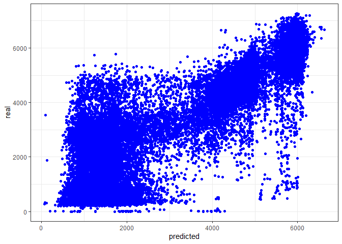

---
title: "Machine Learning I - Regression - Presentation"
author: "<font size=5><b>- Mateusz Domaradzki&Karol Ziolo</b></font>"
output:
  html_document:
    toc: yes
    keep_md: yes
    toc_depth: 3
    toc_float: yes
    theme: united
    highlight: tango
  pdf_document:
    toc: yes
    toc_depth: '3'
---


<br>
<br><br>
<br><br>
<br><br>


# Regression

<br><br>

## Data Preparation


<br>

### Weather

<br>

<font size=5>We decided to use only weather_general, without detailed version of it. Thus, we merged some of the levels</font>


```r
data$weather_general <- as.factor(data$weather_general)

data$weather_general[data$weather_general == "Maze"] <- "Fog"
data$weather_general[data$weather_general == "Haze"] <- "Smoke"
data$weather_general[data$weather_general == "Squall"] <- "Thunderstorm"
```


|Variable     |  Frequency|
|:------------|-----:|
|Clear        |  8020|
|Clouds       | 10163|
|Drizzle      |   919|
|Fog          |   481|
|Mist         |  3491|
|Rain         |  3558|
|Smoke        |   760|
|Snow         |  1794|
|Thunderstorm |   501|
<br>


### Our transformations

<br>
<font size=5>Using barplots we noticed that the hour is highly correlated with the level of traffic</font>
<br>


```r
time_of_the_day<-function(x) {
  result<-list()
  if(x>=6 & x<=8){
    result<-"Traffic_morning_peak_hour"
  } 
  else if(x>8 & x<15){
    result<-"Working_hours"}
  else if(x>=15 & x<=17){
    result<-"Traffic_evening_peak_hour"}
  else{
    result <-"night"}
  return(result)
}
```
<br>

<font size=5>Also the season matters in interactions</font>


```r
season_of_the_year <- function(x) {
  result<-list()
  if(x=='11' || x=='12' || x=='01'){
    result<-"Winter"
  } 
  else if(x=='07' || x=='08' || x=='09' ){
    result<-"Summer_Holidays"}
  else{
    result <-"The_Rest_of_the_season"}
  return(result)
}
```
<br>

<font size=5>The day of the week is also an important factor</font>


```r
day_of_the_wk<- function(x) {
  result<-list()
  if(x=='sobota' || x=='niedziela'){
    result<-"Weekend"
  } 
  else{
    result <-"Working_day"}
  return(result)
}
```
<br>


<br>

### Final data

<font size=5>Our final data looks like that</font>
<font size=4>
<ul>
  <li>We decided to drop cloud_coverage due to 0 correlation with traffic. </li> 
  <li>Rain_mm and snow_mm occur so rarely that we won't use them, as we have weather_general which suggest the weather conditions.</li>
  <li>We dropped some outliers</li>
</ul> 
</font>

<br>


| traffic|weather_general | temperature|season                 |day2        |hour2                     |
|-------:|:---------------|-----------:|:----------------------|:-----------|:-------------------------|
|     508|Clear           |        11.5|The_Rest_of_the_season |Working_day |night                     |
|     323|Clear           |        10.3|The_Rest_of_the_season |Working_day |night                     |
|     274|Clear           |         8.0|The_Rest_of_the_season |Working_day |night                     |
|     372|Clear           |         7.9|The_Rest_of_the_season |Working_day |night                     |
|     812|Clear           |         6.4|The_Rest_of_the_season |Working_day |night                     |
|    2720|Clear           |         5.5|The_Rest_of_the_season |Working_day |night                     |
|    5674|Clear           |         5.1|The_Rest_of_the_season |Working_day |Traffic_morning_peak_hour |
|    6512|Clear           |         5.0|The_Rest_of_the_season |Working_day |Traffic_morning_peak_hour |
|    5473|Clear           |         9.3|The_Rest_of_the_season |Working_day |Working_hours             |
|    5096|Clear           |        18.8|The_Rest_of_the_season |Working_day |Working_hours             |
|    4887|Clear           |        20.1|The_Rest_of_the_season |Working_day |Working_hours             |
|    5335|Clear           |        21.2|The_Rest_of_the_season |Working_day |Working_hours             |
|    5699|Clear           |        22.0|The_Rest_of_the_season |Working_day |Traffic_evening_peak_hour |
|    6130|Clear           |        22.0|The_Rest_of_the_season |Working_day |Traffic_evening_peak_hour |
|    4620|Clouds          |        20.5|The_Rest_of_the_season |Working_day |night                     |
|    3594|Clouds          |        17.5|The_Rest_of_the_season |Working_day |night                     |
|    2895|Clouds          |        15.0|The_Rest_of_the_season |Working_day |night                     |
|    2643|Clear           |        14.0|The_Rest_of_the_season |Working_day |night                     |
|    1783|Clear           |        13.1|The_Rest_of_the_season |Working_day |night                     |
|    1017|Clear           |        12.1|The_Rest_of_the_season |Working_day |night                     |


## Best algorithm 

### What we tried?

<br>

<font size=4>
<ul>
  <li>OLS </li> 
  <li>LASSO </li>
  <li>RIDGE </li>
  <li>Elastic approach between them </li>
  <li>KNN </li>
  <li>SVR </li>
</ul> 
</font>

<br>

### The best algorithm - SVR

<br>


```r
ctrl_cv5 <- trainControl(method = "cv",
                         number = 5)

parametersC_sigma2 <- 
  expand.grid(C = 415,
              sigma = 0.1)


svm_Radial2 <- train(traffic~. + weather_general*hour2  + day2*hour2 + weather_general*day2, 
                            data = data_final, 
                            method = "svmRadial",
                            tuneGrid = parametersC_sigma2,
                            trControl = ctrl_cv5)
```

<br>

### Plot real data/predicted data

<br>
<!-- -->

### EXPECTED MAPE

<font size=4> Im going to apply MAPE from a R package MLmetrics </font>


```
## [1] 2.169793
```


<br>

# Classification

<br>

## Data Exploration


### General outlook on the data

<font size=4> Let read the data. </font>

<br>

### Age

<font size=4> We decided to merge groups "55-64" and "65+" into one group called "55+". </font>

<br>


```r
data2$age[data2$age=="55-64"] <- "55+"
data2$age[data2$age == "65+"] <- "55+"

data2$age = factor(data2$age, levels = c("18-24","25-34","35-44","45-54","55+"),
                   ordered = TRUE)

data2$age <- droplevels(data2$age)
```


<br>

### Education

<font size=4> The education variable has many disproportions so we decided to merge people who left school at or before 18 into one group. </font>

<br>


```r
data2$education[data2$education %in% c("Left school before 16 years",
                                       "Left school at 16 years",
                                       "Left school at 17 years",
                                       "Left school at 18 years")] <- "Left school at or before 18"

data2$education = factor(data2$education, levels = c("Left school at or before 18",
                                                     "Some college or university, no certificate or degree",
                                                     "Professional certificate/ diploma",
                                                     "University degree",
                                                     "Masters degree",
                                                     "Doctorate degree"),
                         ordered = TRUE)
data2$education <- droplevels(data2$education)
```

### Country

<font size=4> There is a small number of people from Canada and Ireland so we decided to assign them to the group of others. </font>

<br>


```r
data2$country[data2$country %in% c("Canada","Ireland")] <- "Other"
```

<br>

### Ethnicity

<font size=4> We decided to drop Ethnicity because we have quite homogeneous sample. </font>

<br>


<br>

### Consumption

<font size=4> We decided to downgrade consumption variables into three groups: "regularly", "occasionally" and "never". We also dropped "Consumption Chocolate" and "Consumption Caffeine".  </font>

<br>


```r
# Vector of consumption variables
consumption_variables = c("consumption_alcohol", "consumption_amphetamines", 
                          "consumption_cannabis", "consumption_mushrooms", 
                          "consumption_nicotine")
# Grouping function
fun = 
  function(x){
  if (x %in% c("never used","used over a decade ago","used in last decade")){
    x = "never"}
  else if (x %in% c("used in last year","used in last month")){
    x = "occasionally"}
  else if (x %in% c("used in last week","used in last day")){ 
    x = "regularly"}
  }

# Applying grouping function
data2[consumption_variables] = unlist(lapply(data2[consumption_variables], function(y) lapply(y, fun)))

# Modifying into factors
data2[consumption_variables] = lapply(data2[consumption_variables], 
                                     function(x) factor(x, levels = c("never","occasionally","regularly"),ordered = TRUE))

# Dropping "Consumption Chocolate" and "Consumption Caffeine" variables
data2 = data2[,-c(14,16)]
```

<br>

### Personality Variables

<font size=4> Checking for outliers. </font>


```r
min_max = matrix(1:14,nrow = 7, ncol = 2)
colnames(min_max) = c("Minimum", "Maximum")
rownames(min_max) = names(which(sapply(data2,is.numeric)))
min_max[,1] = apply(data2[names(which(sapply(data2,is.numeric)))],2, min)
min_max[,2] = apply(data2[names(which(sapply(data2,is.numeric)))],2, max)
kable(min_max)
```


|                              | Minimum| Maximum|
|:-----------------------------|-------:|-------:|
|personality_neuroticism       |       0|     100|
|personality_extraversion      |       0|     100|
|personality_openness          |       0|     100|
|personality_agreeableness     |       0|     100|
|personality_conscientiousness |       0|     100|
|personality_impulsiveness     |       0|     100|
|personality_sensation         |       0|     100|


<font size=4> We decided to aggregate personality variables and create one called "personality". </font>


```r
data2["personality"] =  
  colnames(data2[sapply(data2,is.numeric)])[apply(data2[sapply(data2,is.numeric)],1,which.max)]

data2$personality = as.factor(data2$personality)
```

<br>

### Dependent Variable


```r
kable(table(data2$consumption_cocaine_last_month))
```


|Var1 | Freq|
|:----|----:|
|No   | 1373|
|Yes  |  127|

```r
data2$consumption_cocaine_last_month = factor(data2$consumption_cocaine_last_month, levels = c("No","Yes"), ordered = TRUE)

data2 = data2[sapply(data2,is.factor)]
```

<br>

### Statistical Tests


```r
chisqr = matrix(1:10,nrow = 10, ncol = 1)
colnames(chisqr) = c("p-value")
rownames(chisqr) = names(which(sapply(data2,is.factor)))
chisqr[,1] = apply(data2[names(which(sapply(data2,is.factor)))],2, 
                   function(x) round(chisq.test(x, data2$consumption_cocaine_last_month,correct=FALSE)$p.value,4))

kable(chisqr)
```


|                               | p-value|
|:------------------------------|-------:|
|age                            |  0.0000|
|gender                         |  0.0003|
|education                      |  0.0736|
|consumption_alcohol            |  0.0040|
|consumption_amphetamines       |  0.0000|
|consumption_cannabis           |  0.0000|
|consumption_mushrooms          |  0.0000|
|consumption_nicotine           |  0.0000|
|consumption_cocaine_last_month |  0.0000|
|personality                    |  0.0000|

```r
data2 = data2[,-3]
```

<br>

## Best algorithm 

### What we tried?

<br>

<font size=4>
<ul>
  <li>Logistic </li> 
  <li>KNN </li>
  <li>SVM </li>
  <li>Random Forest (additionally, out of curiosity)</li>
</ul> 
</font>

<br>

### The best algorithm - SVM


```r
parametersC_sigma2 <- 
  expand.grid(C = 0.25,
              sigma = 0.031)

data2_svm_train <- 
  train(consumption_cocaine_last_month ~ .,
        data2,        
        method = "svmRadial",
        metric = "ROC",
        trControl = ctrl_cv5,
        tuneGrid = parametersC_sigma2)

data2_svm_train
```

```
## Support Vector Machines with Radial Basis Function Kernel 
## 
## 1500 samples
##    8 predictor
##    2 classes: 'No', 'Yes' 
## 
## No pre-processing
## Resampling: Cross-Validated (5 fold, repeated 3 times) 
## Summary of sample sizes: 1200, 1200, 1201, 1199, 1200, 1200, ... 
## Addtional sampling using up-sampling
## 
## Resampling results:
## 
##   ROC        Sens       Spec    
##   0.7795483  0.7800495  0.658359
## 
## Tuning parameter 'sigma' was held constant at a value of 0.031
## Tuning
##  parameter 'C' was held constant at a value of 0.25
```

### Balanced Accuracy


```r
svm_fitted = predict(data2_svm_train, data2)
svm_results = summary_binary_class(predicted_classes = svm_fitted,
                     real = data2$consumption_cocaine_last_month)
balanced_accuracy=confusionMatrix(as.factor(svm_fitted), data2$consumption_cocaine_last_month)$byClass[11]
kable(balanced_accuracy)
```


|                  |         x|
|:-----------------|---------:|
|Balanced Accuracy | 0.8052973|

<font size=5><b> Our expected Balanced Accuracy for test dataset equals ``0.8052973`` </b></font> 


