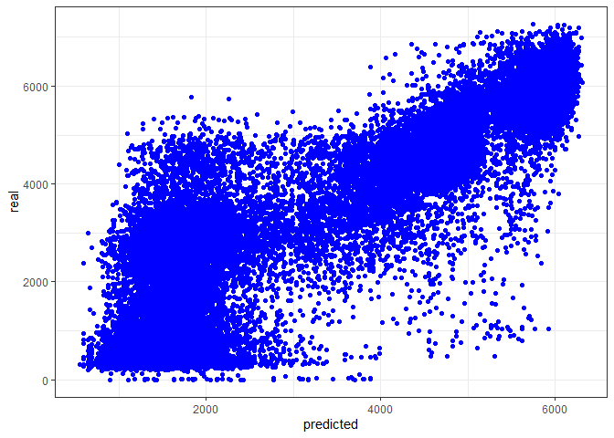

---
title: 'Machine Learning I - Regression - Presentation'
author: <font size=5><b>- Mateusz Domaradzki&Karol Ziolo</b></font>
output: 
  html_document:
    toc: true # table of content true
    keep_md: true
    toc_depth: 3  # upto three depths of headings (specified by #, ## and ###)
    toc_float: TRUE
    theme: united
    highlight: tango
---


<br>
<br><br>
<br><br>
<br><br>


# Regression

<br><br>

## Data Preparation


<br>

### Weather

<br>

<font size=5>We decided to use only weather_general, without detailed verson of it. Thus, we merged some of the levels</font>


```r
data$weather_general <- as.factor(data$weather_general)

data$weather_general[data$weather_general == "Maze"] <- "Fog"
data$weather_general[data$weather_general == "Haze"] <- "Smoke"
data$weather_general[data$weather_general == "Squall"] <- "Thunderstorm"
```


|Variable     |  Frequency|
|:------------|-----:|
|Clear        |  8020|
|Clouds       | 10163|
|Drizzle      |   919|
|Fog          |   481|
|Mist         |  3491|
|Rain         |  3558|
|Smoke        |   760|
|Snow         |  1794|
|Thunderstorm |   501|
<br>


### Our transformations

<br>
<font size=5>Using barplots we noticed that the hour is highly correlated with the level of traffic</font>
<br>


```r
time_of_the_day<-function(x) {
  result<-list()
  if(x>=6 & x<=8){
    result<-"Traffic_morning_peak_hour"
  } 
  else if(x>8 & x<15){
    result<-"Working_hours"}
  else if(x>=15 & x<=17){
    result<-"Traffic_evening_peak_hour"}
  else{
    result <-"night"}
  return(result)
}
```
<br>

<font size=5>Also the season matters in interactions</font>


```r
season_of_the_year <- function(x) {
  result<-list()
  if(x=='11' || x=='12' || x=='01'){
    result<-"Winter"
  } 
  else if(x=='07' || x=='08' || x=='09' ){
    result<-"Summer_Holidays"}
  else{
    result <-"The_Rest_of_the_season"}
  return(result)
}
```
<br>

<font size=5>The day of the week is also an important factor</font>


```r
day_of_the_wk<- function(x) {
  result<-list()
  if(x=='sobota' || x=='niedziela'){
    result<-"Weekend"
  } 
  else{
    result <-"Working_day"}
  return(result)
}
```
<br>


<br>

### Final data

<font size=5>Our final data looks like that</font>
<font size=4>
<ul>
  <li>We decided to drop cloud_coverage due to 0 correlation with traffic. </li> 
  <li>Rain_mm and snow_mm occur so rarely that we won't use them, as we have weather_general which suggest the weather conditions.</li>
  <li>We dropped some outliers</li>
</ul> 
</font>

<br>


| traffic|weather_general | temperature|season                 |day2        |hour2                     |
|-------:|:---------------|-----------:|:----------------------|:-----------|:-------------------------|
|     508|Clear           |        11.5|The_Rest_of_the_season |Working_day |night                     |
|     323|Clear           |        10.3|The_Rest_of_the_season |Working_day |night                     |
|     274|Clear           |         8.0|The_Rest_of_the_season |Working_day |night                     |
|     372|Clear           |         7.9|The_Rest_of_the_season |Working_day |night                     |
|     812|Clear           |         6.4|The_Rest_of_the_season |Working_day |night                     |
|    2720|Clear           |         5.5|The_Rest_of_the_season |Working_day |night                     |
|    5674|Clear           |         5.1|The_Rest_of_the_season |Working_day |Traffic_morning_peak_hour |
|    6512|Clear           |         5.0|The_Rest_of_the_season |Working_day |Traffic_morning_peak_hour |
|    5473|Clear           |         9.3|The_Rest_of_the_season |Working_day |Working_hours             |
|    5096|Clear           |        18.8|The_Rest_of_the_season |Working_day |Working_hours             |
|    4887|Clear           |        20.1|The_Rest_of_the_season |Working_day |Working_hours             |
|    5335|Clear           |        21.2|The_Rest_of_the_season |Working_day |Working_hours             |
|    5699|Clear           |        22.0|The_Rest_of_the_season |Working_day |Traffic_evening_peak_hour |
|    6130|Clear           |        22.0|The_Rest_of_the_season |Working_day |Traffic_evening_peak_hour |
|    4620|Clouds          |        20.5|The_Rest_of_the_season |Working_day |night                     |
|    3594|Clouds          |        17.5|The_Rest_of_the_season |Working_day |night                     |
|    2895|Clouds          |        15.0|The_Rest_of_the_season |Working_day |night                     |
|    2643|Clear           |        14.0|The_Rest_of_the_season |Working_day |night                     |
|    1783|Clear           |        13.1|The_Rest_of_the_season |Working_day |night                     |
|    1017|Clear           |        12.1|The_Rest_of_the_season |Working_day |night                     |


## Best algorithm 

### What we tried?

<br>

<font size=4>
<ul>
  <li>OLS </li> 
  <li>LASSO </li>
  <li>RIDGE </li>
  <li>Elastic approach between them </li>
  <li>KNN </li>
  <li>SVR </li>
</ul> 
</font>

<br>

### The best algorithm - KNN

<br>


```r
ctrl_cv5 <- trainControl(method = "cv",
                         number = 5)

k_possible <-data.frame(k=19) ## The value 19 is the best for our dataset so im gonna go with it

traffic_knn <- 
  train(traffic~. + weather_general*hour2  + day2*hour2 + weather_general*day2, 
        data = data_final,
        method = "knn",
        trControl = ctrl_cv5,
        tuneGrid = k_possible,
        preProcess = c("range"))


traffic_knn
```

```
## k-Nearest Neighbors 
## 
## 29687 samples
##     5 predictor
## 
## Pre-processing: re-scaling to [0, 1] (50) 
## Resampling: Cross-Validated (5 fold) 
## Summary of sample sizes: 23749, 23749, 23749, 23752, 23749 
## Resampling results:
## 
##   RMSE      Rsquared   MAE     
##   1028.246  0.7329305  790.8613
## 
## Tuning parameter 'k' was held constant at a value of 19
```

<br>

### Plot real data/predicted data

<br>
<!-- -->

### EXPECTED MAPE

<font size=4> Im going to apply MAPE from a R package MLmetrics </font>


```
## [1] 2.316903
```

<font size=4> I just added +1 to the data_final$traffic because there are 0 values and there are inf values</font>

<font size=5><b> Our expected MAPE for test dataset equals 2.316903%</b></font>
