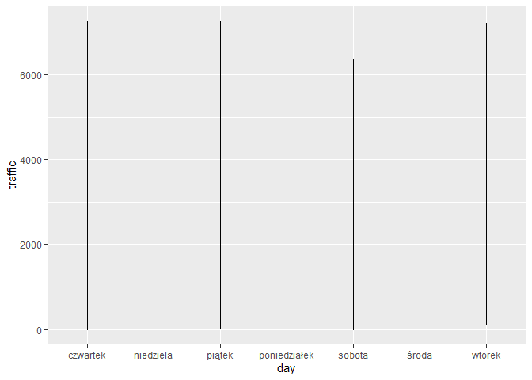

---
title: 'Machine Learning I - Regression - Presentation'
author: <font size=5><b>- Mateusz Domaradzki & Karol Ziolo</b></font>
output: 
  html_document:
    toc: true # table of content true
    keep_md: true
    toc_depth: 3  # upto three depths of headings (specified by #, ## and ###)
    toc_float: TRUE
    theme: united
    highlight: tango
---


<br>
<br><br>
<br><br>
<br><br>


# Regression

<br><br>

## Data Preparation


### General outlook on data

<br>

<font size=4> I read in the data </font>

```r
data <- read.csv("C:/Users/orjen/OneDrive/Desktop/Projekt R/traffic_train.csv")
```
<br>

<font size=4> I check if there are duplicates or NAs </font>


```r
colSums(is.na(data)) %>% 
  sort()
```

```
##           date_time     weather_general    weather_detailed clouds_coverage_pct 
##                   0                   0                   0                   0 
##         temperature             rain_mm             snow_mm             traffic 
##                   0                   0                   0                   0
```

```r
data[which(duplicated(data)),]
```

```
##                 date_time weather_general weather_detailed clouds_coverage_pct
## 28795 2018-12-02 09:00:00            Mist             mist                  90
## 28796 2018-12-02 09:00:00            Snow       light snow                  90
##       temperature rain_mm snow_mm traffic
## 28795         0.6       0       0    2331
## 28796         0.6       0       0    2334
```
<br>

<font size=4> Not really so we can move forward and check pattern in time </font>

<br>
<!-- -->
<br>


### Time preparation

<font size=4> I extract the most interesting part of date-time </font>

<br>

```r
data$date_time <- as.POSIXct(data$date_time, format = "%Y-%m-%d %H:%M:%S")
yq <- as.yearqtr(data$date_time, format = "%Y-%m-%d %H:%M:%S")
data$kwartal<-format(yq, format = "%q")
data$kwartal<- as.factor(data$kwartal)
data$hour<-format(data$date_time, format='%H')
data$month<-format(data$date_time, format='%m')
data$day<-weekdays(data$date_time)
```


<br>

<font size=4> I apply a function to transform hours to parts of the day according to the plot given below. It's also logical and even based in life that people are trying to commute to home in different hours. The best feeling is driving a car in an empty city at 3 am<font/>


```r
time_of_the_day<-function(x) {
  result<-list()
  if(x>=6 & x<=8){
    result<-"Traffic_morning_peak_hour"
  } 
  else if(x>8 & x<15){
    result<-"Working_hours"}
  else if(x>=15 & x<=17){
    result<-"Traffic_evening_peak_hour"}
  else{
    result <-"night"}
  return(result)
}
```

<!-- -->
<br>
<br>
<font size=4> let's apply the function </font>

```r
data$hour2<-lapply(data$hour,time_of_the_day)
data$hour2<-as.character(data$hour2)
data$hour2<- as.factor(data$hour2)
```
<br>

### Weather preparation

<br>
<font size=4> I have to admit that we decided to not use this more rich in description weather column because
we saw many things that we have to merge and diversity provided in weather_general is good enough to judge
what should happen with the traffic. At all not every weather state should affect traffic so we just drop it 
instantly </font>
<br>


```r
kable(table(data$weather_general)) %>%
  sort(decreasing = FALSE)
```

```
##  [1] "|:------------|-----:|" "|Clear        |  8030|" "|Clouds       | 10163|"
##  [4] "|Drizzle      |   919|" "|Fog          |   481|" "|Haze         |   743|"
##  [7] "|Mist         |  3491|" "|Rain         |  3559|" "|Smoke        |    17|"
## [10] "|Snow         |  1794|" "|Squall       |     4|" "|Thunderstorm |   497|"
## [13] "|Var1         |  Freq|"
```

<br>

<font size=4> I decided to merge some of them because logicaly there are the same and should not affect our traffic. 
Of course we can check if the values are different by filtering the data but it may results in overfitting the model.
Let's keep it simple </font>

<br>

<font size=4> Things that should be merged in my opinion:
<ult>
<li> Merge fog and mist </li>
<li> Smoke and Haze </li>
<li> Squall and Thunderstorm </li>
</ult>
<br>


```r
data$weather_general <- as.factor(data$weather_general)

data$weather_general[data$weather_general == "Maze"] <- "Fog"
data$weather_general[data$weather_general == "Haze"] <- "Smoke"
data$weather_general[data$weather_general == "Squall"] <- "Thunderstorm"

data$weather_general <- droplevels(data$weather_general)
kable(table(data$weather_general))
```


|Var1         |  Freq|
|:------------|-----:|
|Clear        |  8030|
|Clouds       | 10163|
|Drizzle      |   919|
|Fog          |   481|
|Mist         |  3491|
|Rain         |  3559|
|Smoke        |   760|
|Snow         |  1794|
|Thunderstorm |   501|
<br>

<font size=4> We won't also use snow nor rain because those things are pretty always equal to 0 </font>


```r
kable(head(table(data$snow_mm),10))
```


|Var1 |  Freq|
|:----|-----:|
|0    | 29635|
|0.05 |    14|
|0.06 |    12|
|0.08 |     2|
|0.1  |     6|
|0.13 |     6|
|0.17 |     3|
|0.21 |     1|
|0.25 |     6|
|0.32 |     5|

```r
kable(head(table(data$rain_mm),10))
```


|Var1 |  Freq|
|:----|-----:|
|0    | 26944|
|0.25 |   679|
|0.26 |     2|
|0.27 |     5|
|0.28 |    19|
|0.29 |     4|
|0.3  |   119|
|0.31 |     2|
|0.32 |    12|
|0.33 |     1|

<br>

<font size=4> Lets check temperature </font>

<br> 

```r
kable(head(table(data$temperature),10))
```


|Var1   | Freq|
|:------|----:|
|-273.1 |   10|
|-29.8  |    1|
|-29.5  |    1|
|-28.9  |    1|
|-28.3  |    4|
|-27.5  |    1|
|-27.4  |    3|
|-27.1  |    1|
|-27    |    1|
|-26.9  |    1|

```r
data<-data[-c(which(data$temperature==-273.1)),]
data<-data[-c(which(data$rain_mm>100)),]
```
<br>

<font size=4> Data seems to be various but we have some outliers (at least I dont believe that we can achieve -273.1.
Also I dropped an outlier from rain (I believe that is an ouliter) </font>

<br>

### Feature selection

<br>

<font size = 4> We also need to check if the data is at least correlated to traffic </font>


|                    | clouds_coverage_pct| temperature|    rain_mm|    snow_mm|    traffic|
|:-------------------|-------------------:|-----------:|----------:|----------:|----------:|
|clouds_coverage_pct |           1.0000000|  -0.1703894|  0.0886892|  0.0351593|  0.0393405|
|temperature         |          -0.1703894|   1.0000000|  0.1027189| -0.0250283|  0.1344646|
|rain_mm             |           0.0886892|   0.1027189|  1.0000000|  0.0002111| -0.0302496|
|snow_mm             |           0.0351593|  -0.0250283|  0.0002111|  1.0000000|  0.0014836|
|traffic             |           0.0393405|   0.1344646| -0.0302496|  0.0014836|  1.0000000|
<br>
<font size=4> Now im sure that I won't use nor rain nor snow nor covarage </font>
<br>

<font size=4> Also ANOVA for categorical values </font>

<br>

|                |          x|
|:---------------|----------:|
|hour2           | 5652.41041|
|weather_general |   49.88013|
|kwartal         |   22.20645|
<br>

<font size=4> A lot of can be improved </font>

<br>

<font szie=4> some ggplots to improve dataset </font>

<br>

<!-- -->

<br>

<!-- -->

<br>

<font size=4> By that we will create 2 functions to divide months and days into useful parts </font>


```r
season_of_the_year <- function(x) {
  result<-list()
  if(x=='11' || x=='12' || x=='01'){
    result<-"Winter"
  } 
  else if(x=='07' || x=='08' || x=='09' ){
    result<-"Summer_Holidays"}
  else{
    result <-"The_Rest_of_the_season"}
  return(result)
}

day_of_the_wk<- function(x) {
  result<-list()
  if(x=='sobota' || x=='niedziela'){
    result<-"Weekend"
  } 
  else{
    result <-"Working_day"}
  return(result)
}

data$season<-lapply(data$month,season_of_the_year)
data$season<-as.character(data$season)
data$season<-as.factor(data$season)

data$day2<-lapply(data$day, day_of_the_wk)
data$day2<-as.character(data$day2)
data$day2<-as.factor(data$day2)
```

<br>
<font size=4> last ANOVA to check if we are in a better position </font>


|                |          x|
|:---------------|----------:|
|hour2           | 5652.41041|
|day2            | 1596.66607|
|season          |   60.38177|
|weather_general |   49.88013|
|kwartal         |   22.20645|
<br>

<font size=4> That's seems like a success so I go to proceed some algorithms</font>

<br>

<font size=4> Our final dataset: </font>


```r
data_final<-data[,c(8,2,5,13,14,15)]
kable(head(data_final,20))
```


| traffic|weather_general | temperature|hour2                     |season                 |day2        |
|-------:|:---------------|-----------:|:-------------------------|:----------------------|:-----------|
|     508|Clear           |        11.5|night                     |The_Rest_of_the_season |Working_day |
|     323|Clear           |        10.3|night                     |The_Rest_of_the_season |Working_day |
|     274|Clear           |         8.0|night                     |The_Rest_of_the_season |Working_day |
|     372|Clear           |         7.9|night                     |The_Rest_of_the_season |Working_day |
|     812|Clear           |         6.4|night                     |The_Rest_of_the_season |Working_day |
|    2720|Clear           |         5.5|night                     |The_Rest_of_the_season |Working_day |
|    5674|Clear           |         5.1|night                     |The_Rest_of_the_season |Working_day |
|    6512|Clear           |         5.0|night                     |The_Rest_of_the_season |Working_day |
|    5473|Clear           |         9.3|night                     |The_Rest_of_the_season |Working_day |
|    5096|Clear           |        18.8|night                     |The_Rest_of_the_season |Working_day |
|    4887|Clear           |        20.1|night                     |The_Rest_of_the_season |Working_day |
|    5335|Clear           |        21.2|night                     |The_Rest_of_the_season |Working_day |
|    5699|Clear           |        22.0|Traffic_evening_peak_hour |The_Rest_of_the_season |Working_day |
|    6130|Clear           |        22.0|Traffic_evening_peak_hour |The_Rest_of_the_season |Working_day |
|    4620|Clouds          |        20.5|night                     |The_Rest_of_the_season |Working_day |
|    3594|Clouds          |        17.5|night                     |The_Rest_of_the_season |Working_day |
|    2895|Clouds          |        15.0|night                     |The_Rest_of_the_season |Working_day |
|    2643|Clear           |        14.0|night                     |The_Rest_of_the_season |Working_day |
|    1783|Clear           |        13.1|night                     |The_Rest_of_the_season |Working_day |
|    1017|Clear           |        12.1|night                     |The_Rest_of_the_season |Working_day |
<br>


## Algorithms

<br>

<font size=5> We decided that we are going to try to use more or less those 5 algorithms </font>
<br>
<font size=4>
<ul>
  <li>OLS </li> 
  <li>LASSO </li>
  <li>RIDGE </li>
  <li>Elastic approach between them </li>
  <li>KNN </li>
  <li>SVR </li>
</ul> 
</font>

<br>

<font size=4> We will try to check both ends, I mean high variance and low bias plus low variance and high bias then we will use linear regression + Lasso/Ridge. Then we have two imporant efficient algorithms KNN which is one of the most optimal accoring to books and SVR which is also very sufficient especially if we have weird combinations in dataset </font>

<br>

### Linear regression

<br>

<font size=4> setting the right options </font


```r
options(contrasts = c("contr.treatment",  # for non-ordinal factors
                      "contr.treatment")) # for ordinal factors
```

<br>

<font size=4> I will try 2 models, one clear and one with interactions between variables. 
I've been doing some experiments with them and which are the best so below I will show
only the best interactions I could find and that are logical for me </font>

<br>


```r
#model without interactions
traffic_lm <- lm(traffic~. -1, 
                 data = data_final) 

summary(traffic_lm)
```

```
## 
## Call:
## lm(formula = traffic ~ . - 1, data = data_final)
## 
## Residuals:
##     Min      1Q  Median      3Q     Max 
## -4911.8 -1402.5    41.6  1445.7  4427.3 
## 
## Coefficients:
##                                Estimate Std. Error t value Pr(>|t|)    
## weather_generalClear           1734.785     36.742  47.216  < 2e-16 ***
## weather_generalClouds          1998.959     37.944  52.682  < 2e-16 ***
## weather_generalDrizzle         1769.942     68.043  26.012  < 2e-16 ***
## weather_generalFog             1556.417     85.940  18.111  < 2e-16 ***
## weather_generalMist            1663.915     45.189  36.821  < 2e-16 ***
## weather_generalRain            1744.106     45.784  38.094  < 2e-16 ***
## weather_generalSmoke           2250.029     71.794  31.340  < 2e-16 ***
## weather_generalSnow            1863.488     53.915  34.563  < 2e-16 ***
## weather_generalThunderstorm    1392.242     85.219  16.337  < 2e-16 ***
## temperature                      22.893      1.147  19.953  < 2e-16 ***
## hour2Traffic_evening_peak_hour 2317.681     31.399  73.813  < 2e-16 ***
## seasonThe_Rest_of_the_season    332.376     29.283  11.351  < 2e-16 ***
## seasonWinter                    292.033     39.627   7.369 1.76e-13 ***
## day2Working_day                 987.993     22.428  44.052  < 2e-16 ***
## ---
## Signif. codes:  0 '***' 0.001 '**' 0.01 '*' 0.05 '.' 0.1 ' ' 1
## 
## Residual standard error: 1744 on 29673 degrees of freedom
## Multiple R-squared:  0.7885,	Adjusted R-squared:  0.7884 
## F-statistic:  7904 on 14 and 29673 DF,  p-value: < 2.2e-16
```

```r
#model with interactions
traffic_lm2 <- lm(traffic~. + weather_general*hour2  + day2*hour2 + weather_general*day2 -1, # best formula
                 data = data_final)
summary(traffic_lm2)
```

```
## 
## Call:
## lm(formula = traffic ~ . + weather_general * hour2 + day2 * hour2 + 
##     weather_general * day2 - 1, data = data_final)
## 
## Residuals:
##     Min      1Q  Median      3Q     Max 
## -4415.4 -1411.2    34.4  1442.6  4526.8 
## 
## Coefficients:
##                                                            Estimate Std. Error
## weather_generalClear                                       1892.641     44.577
## weather_generalClouds                                      2130.941     45.385
## weather_generalDrizzle                                     1845.135    117.212
## weather_generalFog                                         1121.575    143.798
## weather_generalMist                                        1530.677     63.193
## weather_generalRain                                        1753.733     65.920
## weather_generalSmoke                                       2085.923    123.648
## weather_generalSnow                                        1926.640     86.537
## weather_generalThunderstorm                                1104.823    138.808
## temperature                                                  23.066      1.148
## hour2Traffic_evening_peak_hour                             1960.609     79.509
## seasonThe_Rest_of_the_season                                330.650     29.222
## seasonWinter                                                294.128     39.552
## day2Working_day                                             736.169     42.930
## weather_generalClouds:hour2Traffic_evening_peak_hour       -276.044     79.268
## weather_generalDrizzle:hour2Traffic_evening_peak_hour        36.089    181.647
## weather_generalFog:hour2Traffic_evening_peak_hour          -725.057    402.884
## weather_generalMist:hour2Traffic_evening_peak_hour          -45.670    131.054
## weather_generalRain:hour2Traffic_evening_peak_hour          -54.000    107.048
## weather_generalSmoke:hour2Traffic_evening_peak_hour        -552.226    187.054
## weather_generalSnow:hour2Traffic_evening_peak_hour         -295.007    145.793
## weather_generalThunderstorm:hour2Traffic_evening_peak_hour   10.510    276.394
## hour2Traffic_evening_peak_hour:day2Working_day              728.934     68.645
## weather_generalClouds:day2Working_day                        89.838     57.372
## weather_generalDrizzle:day2Working_day                      113.515    135.426
## weather_generalFog:day2Working_day                          918.116    175.789
## weather_generalMist:day2Working_day                         429.810     77.452
## weather_generalRain:day2Working_day                         217.306     78.338
## weather_generalSmoke:day2Working_day                        574.414    144.680
## weather_generalSnow:day2Working_day                         180.172    102.551
## weather_generalThunderstorm:day2Working_day                 670.847    168.856
##                                                            t value Pr(>|t|)    
## weather_generalClear                                        42.457  < 2e-16 ***
## weather_generalClouds                                       46.952  < 2e-16 ***
## weather_generalDrizzle                                      15.742  < 2e-16 ***
## weather_generalFog                                           7.800 6.41e-15 ***
## weather_generalMist                                         24.222  < 2e-16 ***
## weather_generalRain                                         26.604  < 2e-16 ***
## weather_generalSmoke                                        16.870  < 2e-16 ***
## weather_generalSnow                                         22.264  < 2e-16 ***
## weather_generalThunderstorm                                  7.959 1.79e-15 ***
## temperature                                                 20.101  < 2e-16 ***
## hour2Traffic_evening_peak_hour                              24.659  < 2e-16 ***
## seasonThe_Rest_of_the_season                                11.315  < 2e-16 ***
## seasonWinter                                                 7.437 1.06e-13 ***
## day2Working_day                                             17.148  < 2e-16 ***
## weather_generalClouds:hour2Traffic_evening_peak_hour        -3.482 0.000498 ***
## weather_generalDrizzle:hour2Traffic_evening_peak_hour        0.199 0.842519    
## weather_generalFog:hour2Traffic_evening_peak_hour           -1.800 0.071923 .  
## weather_generalMist:hour2Traffic_evening_peak_hour          -0.348 0.727483    
## weather_generalRain:hour2Traffic_evening_peak_hour          -0.504 0.613953    
## weather_generalSmoke:hour2Traffic_evening_peak_hour         -2.952 0.003157 ** 
## weather_generalSnow:hour2Traffic_evening_peak_hour          -2.023 0.043034 *  
## weather_generalThunderstorm:hour2Traffic_evening_peak_hour   0.038 0.969668    
## hour2Traffic_evening_peak_hour:day2Working_day              10.619  < 2e-16 ***
## weather_generalClouds:day2Working_day                        1.566 0.117387    
## weather_generalDrizzle:day2Working_day                       0.838 0.401922    
## weather_generalFog:day2Working_day                           5.223 1.77e-07 ***
## weather_generalMist:day2Working_day                          5.549 2.89e-08 ***
## weather_generalRain:day2Working_day                          2.774 0.005542 ** 
## weather_generalSmoke:day2Working_day                         3.970 7.20e-05 ***
## weather_generalSnow:day2Working_day                          1.757 0.078947 .  
## weather_generalThunderstorm:day2Working_day                  3.973 7.12e-05 ***
## ---
## Signif. codes:  0 '***' 0.001 '**' 0.01 '*' 0.05 '.' 0.1 ' ' 1
## 
## Residual standard error: 1739 on 29656 degrees of freedom
## Multiple R-squared:   0.79,	Adjusted R-squared:  0.7898 
## F-statistic:  3598 on 31 and 29656 DF,  p-value: < 2.2e-16
```

```r
traffic_predicted <- predict(traffic_lm)
traffic_predicted2 <- predict(traffic_lm2)
```

<br>

<font size=4> let's plot real vs predicted values </font>

<br>


### Lasso/Ridge/Elastic approach

<br>
<font size=4> The good thing about lasso/Ridge is that we can apply both of them to erase non important values 
and set aplha at a certain level to chose which one we would love to use. This method is at the other
end of bias/variance trade plot </font>

<br>

#### Ridge

<font size=4> lets start with ridge regression </font>
<br>


```r
ctrl_cv5 <- trainControl(method = "cv",
                         number = 5) ## cross-validation


parameters_ridge <- expand.grid(alpha = 0,
                                lambda = seq(0, 1e3, 1))

traffic_ridge <- train(traffic~. + weather_general*hour2  + day2*hour2 + weather_general*day2 -1,
                       data = data_final,
                       method = "glmnet", 
                       tuneGrid = parameters_ridge,
                       trControl = ctrl_cv5)

traffic_ridge$bestTune
```

```
##    alpha lambda
## 80     0     79
```

<br>
<font size=4> Lamba is equals 79 so really close to the linear regression. Lets check LASSO -> RMSE about 1740 </font>
<br>


```r
parameters_lasso <- expand.grid(alpha = 1,
                                lambda = seq(1, 1e4, 10))

traffic_lasso<- train(traffic~. + weather_general*hour2  + day2*hour2 + weather_general*day2 -1,
                      data = data_final,
                      method = "glmnet", 
                      tuneGrid = parameters_lasso,
                      trControl = ctrl_cv5)
```

```
## Warning in nominalTrainWorkflow(x = x, y = y, wts = weights, info = trainInfo, :
## There were missing values in resampled performance measures.
```

```r
traffic_lasso$bestTune
```

```
##   alpha lambda
## 1     1      1
```

<br>

<font size=4> lambda and alfa equals to 1, very interesting to be honest </font>

<br>

<font size=4> Let's check the elastic approach in Alpha </font>

<br>

<font size=4> I experimented some with this algorithm to check between which values of lambada/alpha I should choose.
Do thousands or houndreds are required? Not really, the best set is with lambda between 0 and 10 with alpha around 0.8 </font>


```r
set.seed(2137) ## Let's set seed because lambda and alfa may vary but there are both really similar, just to keep it constant
parameters_elastic2 <- expand.grid(alpha = seq(0, 1, 0.2), 
                                   lambda = seq(0, 10, 0.1))

traffic_elastic <- train(traffic~. + weather_general*hour2  + day2*hour2 + weather_general*day2,
                         data = data_final,
                         method = "glmnet", 
                         tuneGrid = parameters_elastic2,
                         trControl = ctrl_cv5)


traffic_elastic$bestTune
```

```
##     alpha lambda
## 122   0.2      2
```

<br>

<font size=4> So we may be quite sure that between those 3 algorithms we are going to the next point with an elastic approach
and alpha=0.2 with lambda = 2 </font>

<br>

<!-- -->

<br>

### KNN

<br>
<font size=4> I decided to use this algorithm because in my books on Machine Learning they say this algorithm may be the
most accurate one in many cases. What I mean, we don't really use any presumptions and we only
match something because of neighbours. In this case, when it's hard for my data to fit in any
kind of regression that assume for example normal distribution, or try to fit to data any coefficients
this one may be really relevant player. We will see at the end in the comparison! </font>

<br>

<font size=4> Once again i experimented between different values of K for KNN and I decided to go with 19 </font>


```r
k_possible <-data.frame(k=19)

traffic_knn <- 
  train(traffic~. + weather_general*hour2  + day2*hour2 + weather_general*day2, 
        data = data_final,
        method = "knn",
        trControl = ctrl_cv5,
        tuneGrid = k_possible,
        preProcess = c("range"))

## k=19 is the lowest RMSE we can obtain, So I will go with that.
traffic_knn
```

```
## k-Nearest Neighbors 
## 
## 29687 samples
##     5 predictor
## 
## Pre-processing: re-scaling to [0, 1] (30) 
## Resampling: Cross-Validated (5 fold) 
## Summary of sample sizes: 23748, 23750, 23750, 23748, 23752 
## Resampling results:
## 
##   RMSE      Rsquared   MAE     
##   1733.878  0.2432712  1433.306
## 
## Tuning parameter 'k' was held constant at a value of 19
```

<br>

<font size=4> let's plot it </font>


```
## List of 93
##  $ line                      :List of 6
##   ..$ colour       : chr "black"
##   ..$ size         : num 0.5
##   ..$ linetype     : num 1
##   ..$ lineend      : chr "butt"
##   ..$ arrow        : logi FALSE
##   ..$ inherit.blank: logi TRUE
##   ..- attr(*, "class")= chr [1:2] "element_line" "element"
##  $ rect                      :List of 5
##   ..$ fill         : chr "white"
##   ..$ colour       : chr "black"
##   ..$ size         : num 0.5
##   ..$ linetype     : num 1
##   ..$ inherit.blank: logi TRUE
##   ..- attr(*, "class")= chr [1:2] "element_rect" "element"
##  $ text                      :List of 11
##   ..$ family       : chr ""
##   ..$ face         : chr "plain"
##   ..$ colour       : chr "black"
##   ..$ size         : num 11
##   ..$ hjust        : num 0.5
##   ..$ vjust        : num 0.5
##   ..$ angle        : num 0
##   ..$ lineheight   : num 0.9
##   ..$ margin       : 'margin' num [1:4] 0points 0points 0points 0points
##   .. ..- attr(*, "unit")= int 8
##   ..$ debug        : logi FALSE
##   ..$ inherit.blank: logi TRUE
##   ..- attr(*, "class")= chr [1:2] "element_text" "element"
##  $ title                     : NULL
##  $ aspect.ratio              : NULL
##  $ axis.title                : NULL
##  $ axis.title.x              :List of 11
##   ..$ family       : NULL
##   ..$ face         : NULL
##   ..$ colour       : NULL
##   ..$ size         : NULL
##   ..$ hjust        : NULL
##   ..$ vjust        : num 1
##   ..$ angle        : NULL
##   ..$ lineheight   : NULL
##   ..$ margin       : 'margin' num [1:4] 2.75points 0points 0points 0points
##   .. ..- attr(*, "unit")= int 8
##   ..$ debug        : NULL
##   ..$ inherit.blank: logi TRUE
##   ..- attr(*, "class")= chr [1:2] "element_text" "element"
##  $ axis.title.x.top          :List of 11
##   ..$ family       : NULL
##   ..$ face         : NULL
##   ..$ colour       : NULL
##   ..$ size         : NULL
##   ..$ hjust        : NULL
##   ..$ vjust        : num 0
##   ..$ angle        : NULL
##   ..$ lineheight   : NULL
##   ..$ margin       : 'margin' num [1:4] 0points 0points 2.75points 0points
##   .. ..- attr(*, "unit")= int 8
##   ..$ debug        : NULL
##   ..$ inherit.blank: logi TRUE
##   ..- attr(*, "class")= chr [1:2] "element_text" "element"
##  $ axis.title.x.bottom       : NULL
##  $ axis.title.y              :List of 11
##   ..$ family       : NULL
##   ..$ face         : NULL
##   ..$ colour       : NULL
##   ..$ size         : NULL
##   ..$ hjust        : NULL
##   ..$ vjust        : num 1
##   ..$ angle        : num 90
##   ..$ lineheight   : NULL
##   ..$ margin       : 'margin' num [1:4] 0points 2.75points 0points 0points
##   .. ..- attr(*, "unit")= int 8
##   ..$ debug        : NULL
##   ..$ inherit.blank: logi TRUE
##   ..- attr(*, "class")= chr [1:2] "element_text" "element"
##  $ axis.title.y.left         : NULL
##  $ axis.title.y.right        :List of 11
##   ..$ family       : NULL
##   ..$ face         : NULL
##   ..$ colour       : NULL
##   ..$ size         : NULL
##   ..$ hjust        : NULL
##   ..$ vjust        : num 0
##   ..$ angle        : num -90
##   ..$ lineheight   : NULL
##   ..$ margin       : 'margin' num [1:4] 0points 0points 0points 2.75points
##   .. ..- attr(*, "unit")= int 8
##   ..$ debug        : NULL
##   ..$ inherit.blank: logi TRUE
##   ..- attr(*, "class")= chr [1:2] "element_text" "element"
##  $ axis.text                 :List of 11
##   ..$ family       : NULL
##   ..$ face         : NULL
##   ..$ colour       : chr "grey30"
##   ..$ size         : 'rel' num 0.8
##   ..$ hjust        : NULL
##   ..$ vjust        : NULL
##   ..$ angle        : NULL
##   ..$ lineheight   : NULL
##   ..$ margin       : NULL
##   ..$ debug        : NULL
##   ..$ inherit.blank: logi TRUE
##   ..- attr(*, "class")= chr [1:2] "element_text" "element"
##  $ axis.text.x               :List of 11
##   ..$ family       : NULL
##   ..$ face         : NULL
##   ..$ colour       : NULL
##   ..$ size         : NULL
##   ..$ hjust        : NULL
##   ..$ vjust        : num 1
##   ..$ angle        : NULL
##   ..$ lineheight   : NULL
##   ..$ margin       : 'margin' num [1:4] 2.2points 0points 0points 0points
##   .. ..- attr(*, "unit")= int 8
##   ..$ debug        : NULL
##   ..$ inherit.blank: logi TRUE
##   ..- attr(*, "class")= chr [1:2] "element_text" "element"
##  $ axis.text.x.top           :List of 11
##   ..$ family       : NULL
##   ..$ face         : NULL
##   ..$ colour       : NULL
##   ..$ size         : NULL
##   ..$ hjust        : NULL
##   ..$ vjust        : num 0
##   ..$ angle        : NULL
##   ..$ lineheight   : NULL
##   ..$ margin       : 'margin' num [1:4] 0points 0points 2.2points 0points
##   .. ..- attr(*, "unit")= int 8
##   ..$ debug        : NULL
##   ..$ inherit.blank: logi TRUE
##   ..- attr(*, "class")= chr [1:2] "element_text" "element"
##  $ axis.text.x.bottom        : NULL
##  $ axis.text.y               :List of 11
##   ..$ family       : NULL
##   ..$ face         : NULL
##   ..$ colour       : NULL
##   ..$ size         : NULL
##   ..$ hjust        : num 1
##   ..$ vjust        : NULL
##   ..$ angle        : NULL
##   ..$ lineheight   : NULL
##   ..$ margin       : 'margin' num [1:4] 0points 2.2points 0points 0points
##   .. ..- attr(*, "unit")= int 8
##   ..$ debug        : NULL
##   ..$ inherit.blank: logi TRUE
##   ..- attr(*, "class")= chr [1:2] "element_text" "element"
##  $ axis.text.y.left          : NULL
##  $ axis.text.y.right         :List of 11
##   ..$ family       : NULL
##   ..$ face         : NULL
##   ..$ colour       : NULL
##   ..$ size         : NULL
##   ..$ hjust        : num 0
##   ..$ vjust        : NULL
##   ..$ angle        : NULL
##   ..$ lineheight   : NULL
##   ..$ margin       : 'margin' num [1:4] 0points 0points 0points 2.2points
##   .. ..- attr(*, "unit")= int 8
##   ..$ debug        : NULL
##   ..$ inherit.blank: logi TRUE
##   ..- attr(*, "class")= chr [1:2] "element_text" "element"
##  $ axis.ticks                :List of 6
##   ..$ colour       : chr "grey20"
##   ..$ size         : NULL
##   ..$ linetype     : NULL
##   ..$ lineend      : NULL
##   ..$ arrow        : logi FALSE
##   ..$ inherit.blank: logi TRUE
##   ..- attr(*, "class")= chr [1:2] "element_line" "element"
##  $ axis.ticks.x              : NULL
##  $ axis.ticks.x.top          : NULL
##  $ axis.ticks.x.bottom       : NULL
##  $ axis.ticks.y              : NULL
##  $ axis.ticks.y.left         : NULL
##  $ axis.ticks.y.right        : NULL
##  $ axis.ticks.length         : 'simpleUnit' num 2.75points
##   ..- attr(*, "unit")= int 8
##  $ axis.ticks.length.x       : NULL
##  $ axis.ticks.length.x.top   : NULL
##  $ axis.ticks.length.x.bottom: NULL
##  $ axis.ticks.length.y       : NULL
##  $ axis.ticks.length.y.left  : NULL
##  $ axis.ticks.length.y.right : NULL
##  $ axis.line                 : list()
##   ..- attr(*, "class")= chr [1:2] "element_blank" "element"
##  $ axis.line.x               : NULL
##  $ axis.line.x.top           : NULL
##  $ axis.line.x.bottom        : NULL
##  $ axis.line.y               : NULL
##  $ axis.line.y.left          : NULL
##  $ axis.line.y.right         : NULL
##  $ legend.background         :List of 5
##   ..$ fill         : NULL
##   ..$ colour       : logi NA
##   ..$ size         : NULL
##   ..$ linetype     : NULL
##   ..$ inherit.blank: logi TRUE
##   ..- attr(*, "class")= chr [1:2] "element_rect" "element"
##  $ legend.margin             : 'margin' num [1:4] 5.5points 5.5points 5.5points 5.5points
##   ..- attr(*, "unit")= int 8
##  $ legend.spacing            : 'simpleUnit' num 11points
##   ..- attr(*, "unit")= int 8
##  $ legend.spacing.x          : NULL
##  $ legend.spacing.y          : NULL
##  $ legend.key                :List of 5
##   ..$ fill         : chr "white"
##   ..$ colour       : logi NA
##   ..$ size         : NULL
##   ..$ linetype     : NULL
##   ..$ inherit.blank: logi TRUE
##   ..- attr(*, "class")= chr [1:2] "element_rect" "element"
##  $ legend.key.size           : 'simpleUnit' num 1.2lines
##   ..- attr(*, "unit")= int 3
##  $ legend.key.height         : NULL
##  $ legend.key.width          : NULL
##  $ legend.text               :List of 11
##   ..$ family       : NULL
##   ..$ face         : NULL
##   ..$ colour       : NULL
##   ..$ size         : 'rel' num 0.8
##   ..$ hjust        : NULL
##   ..$ vjust        : NULL
##   ..$ angle        : NULL
##   ..$ lineheight   : NULL
##   ..$ margin       : NULL
##   ..$ debug        : NULL
##   ..$ inherit.blank: logi TRUE
##   ..- attr(*, "class")= chr [1:2] "element_text" "element"
##  $ legend.text.align         : NULL
##  $ legend.title              :List of 11
##   ..$ family       : NULL
##   ..$ face         : NULL
##   ..$ colour       : NULL
##   ..$ size         : NULL
##   ..$ hjust        : num 0
##   ..$ vjust        : NULL
##   ..$ angle        : NULL
##   ..$ lineheight   : NULL
##   ..$ margin       : NULL
##   ..$ debug        : NULL
##   ..$ inherit.blank: logi TRUE
##   ..- attr(*, "class")= chr [1:2] "element_text" "element"
##  $ legend.title.align        : NULL
##  $ legend.position           : chr "right"
##  $ legend.direction          : NULL
##  $ legend.justification      : chr "center"
##  $ legend.box                : NULL
##  $ legend.box.just           : NULL
##  $ legend.box.margin         : 'margin' num [1:4] 0cm 0cm 0cm 0cm
##   ..- attr(*, "unit")= int 1
##  $ legend.box.background     : list()
##   ..- attr(*, "class")= chr [1:2] "element_blank" "element"
##  $ legend.box.spacing        : 'simpleUnit' num 11points
##   ..- attr(*, "unit")= int 8
##  $ panel.background          :List of 5
##   ..$ fill         : chr "white"
##   ..$ colour       : logi NA
##   ..$ size         : NULL
##   ..$ linetype     : NULL
##   ..$ inherit.blank: logi TRUE
##   ..- attr(*, "class")= chr [1:2] "element_rect" "element"
##  $ panel.border              :List of 5
##   ..$ fill         : logi NA
##   ..$ colour       : chr "grey20"
##   ..$ size         : NULL
##   ..$ linetype     : NULL
##   ..$ inherit.blank: logi TRUE
##   ..- attr(*, "class")= chr [1:2] "element_rect" "element"
##  $ panel.spacing             : 'simpleUnit' num 5.5points
##   ..- attr(*, "unit")= int 8
##  $ panel.spacing.x           : NULL
##  $ panel.spacing.y           : NULL
##  $ panel.grid                :List of 6
##   ..$ colour       : chr "grey92"
##   ..$ size         : NULL
##   ..$ linetype     : NULL
##   ..$ lineend      : NULL
##   ..$ arrow        : logi FALSE
##   ..$ inherit.blank: logi TRUE
##   ..- attr(*, "class")= chr [1:2] "element_line" "element"
##  $ panel.grid.major          : NULL
##  $ panel.grid.minor          :List of 6
##   ..$ colour       : NULL
##   ..$ size         : 'rel' num 0.5
##   ..$ linetype     : NULL
##   ..$ lineend      : NULL
##   ..$ arrow        : logi FALSE
##   ..$ inherit.blank: logi TRUE
##   ..- attr(*, "class")= chr [1:2] "element_line" "element"
##  $ panel.grid.major.x        : NULL
##  $ panel.grid.major.y        : NULL
##  $ panel.grid.minor.x        : NULL
##  $ panel.grid.minor.y        : NULL
##  $ panel.ontop               : logi FALSE
##  $ plot.background           :List of 5
##   ..$ fill         : NULL
##   ..$ colour       : chr "white"
##   ..$ size         : NULL
##   ..$ linetype     : NULL
##   ..$ inherit.blank: logi TRUE
##   ..- attr(*, "class")= chr [1:2] "element_rect" "element"
##  $ plot.title                :List of 11
##   ..$ family       : NULL
##   ..$ face         : NULL
##   ..$ colour       : NULL
##   ..$ size         : 'rel' num 1.2
##   ..$ hjust        : num 0
##   ..$ vjust        : num 1
##   ..$ angle        : NULL
##   ..$ lineheight   : NULL
##   ..$ margin       : 'margin' num [1:4] 0points 0points 5.5points 0points
##   .. ..- attr(*, "unit")= int 8
##   ..$ debug        : NULL
##   ..$ inherit.blank: logi TRUE
##   ..- attr(*, "class")= chr [1:2] "element_text" "element"
##  $ plot.title.position       : chr "panel"
##  $ plot.subtitle             :List of 11
##   ..$ family       : NULL
##   ..$ face         : NULL
##   ..$ colour       : NULL
##   ..$ size         : NULL
##   ..$ hjust        : num 0
##   ..$ vjust        : num 1
##   ..$ angle        : NULL
##   ..$ lineheight   : NULL
##   ..$ margin       : 'margin' num [1:4] 0points 0points 5.5points 0points
##   .. ..- attr(*, "unit")= int 8
##   ..$ debug        : NULL
##   ..$ inherit.blank: logi TRUE
##   ..- attr(*, "class")= chr [1:2] "element_text" "element"
##  $ plot.caption              :List of 11
##   ..$ family       : NULL
##   ..$ face         : NULL
##   ..$ colour       : NULL
##   ..$ size         : 'rel' num 0.8
##   ..$ hjust        : num 1
##   ..$ vjust        : num 1
##   ..$ angle        : NULL
##   ..$ lineheight   : NULL
##   ..$ margin       : 'margin' num [1:4] 5.5points 0points 0points 0points
##   .. ..- attr(*, "unit")= int 8
##   ..$ debug        : NULL
##   ..$ inherit.blank: logi TRUE
##   ..- attr(*, "class")= chr [1:2] "element_text" "element"
##  $ plot.caption.position     : chr "panel"
##  $ plot.tag                  :List of 11
##   ..$ family       : NULL
##   ..$ face         : NULL
##   ..$ colour       : NULL
##   ..$ size         : 'rel' num 1.2
##   ..$ hjust        : num 0.5
##   ..$ vjust        : num 0.5
##   ..$ angle        : NULL
##   ..$ lineheight   : NULL
##   ..$ margin       : NULL
##   ..$ debug        : NULL
##   ..$ inherit.blank: logi TRUE
##   ..- attr(*, "class")= chr [1:2] "element_text" "element"
##  $ plot.tag.position         : chr "topleft"
##  $ plot.margin               : 'margin' num [1:4] 5.5points 5.5points 5.5points 5.5points
##   ..- attr(*, "unit")= int 8
##  $ strip.background          :List of 5
##   ..$ fill         : chr "grey85"
##   ..$ colour       : chr "grey20"
##   ..$ size         : NULL
##   ..$ linetype     : NULL
##   ..$ inherit.blank: logi TRUE
##   ..- attr(*, "class")= chr [1:2] "element_rect" "element"
##  $ strip.background.x        : NULL
##  $ strip.background.y        : NULL
##  $ strip.placement           : chr "inside"
##  $ strip.text                :List of 11
##   ..$ family       : NULL
##   ..$ face         : NULL
##   ..$ colour       : chr "grey10"
##   ..$ size         : 'rel' num 0.8
##   ..$ hjust        : NULL
##   ..$ vjust        : NULL
##   ..$ angle        : NULL
##   ..$ lineheight   : NULL
##   ..$ margin       : 'margin' num [1:4] 4.4points 4.4points 4.4points 4.4points
##   .. ..- attr(*, "unit")= int 8
##   ..$ debug        : NULL
##   ..$ inherit.blank: logi TRUE
##   ..- attr(*, "class")= chr [1:2] "element_text" "element"
##  $ strip.text.x              : NULL
##  $ strip.text.y              :List of 11
##   ..$ family       : NULL
##   ..$ face         : NULL
##   ..$ colour       : NULL
##   ..$ size         : NULL
##   ..$ hjust        : NULL
##   ..$ vjust        : NULL
##   ..$ angle        : num -90
##   ..$ lineheight   : NULL
##   ..$ margin       : NULL
##   ..$ debug        : NULL
##   ..$ inherit.blank: logi TRUE
##   ..- attr(*, "class")= chr [1:2] "element_text" "element"
##  $ strip.switch.pad.grid     : 'simpleUnit' num 2.75points
##   ..- attr(*, "unit")= int 8
##  $ strip.switch.pad.wrap     : 'simpleUnit' num 2.75points
##   ..- attr(*, "unit")= int 8
##  $ strip.text.y.left         :List of 11
##   ..$ family       : NULL
##   ..$ face         : NULL
##   ..$ colour       : NULL
##   ..$ size         : NULL
##   ..$ hjust        : NULL
##   ..$ vjust        : NULL
##   ..$ angle        : num 90
##   ..$ lineheight   : NULL
##   ..$ margin       : NULL
##   ..$ debug        : NULL
##   ..$ inherit.blank: logi TRUE
##   ..- attr(*, "class")= chr [1:2] "element_text" "element"
##  - attr(*, "class")= chr [1:2] "theme" "gg"
##  - attr(*, "complete")= logi TRUE
##  - attr(*, "validate")= logi TRUE
```

<!-- -->

### SVR 

<br>

<font size=4> I would like to start with a point that my laptop is kinda slow and I didn't menage to estimate 
any combination of sigma and C on a full dataset. So I drew a sample of 10% observations and then adjusted my
sigma and C. Therefore this would be the most optimal algorithm but I don't have a possibility to check it.
Thus, below I present the best possible algorithm I could estimate on a random sample.
Then of course I checked that on a biggest sample (around 30% of observations) and couple times on a full dataset.
But most estimations were conducted on small samples </font>
<br>


```r
parametersC_sigma2 <- 
  expand.grid(C = 415,
              sigma = 0.1)


svm_Radial2 <- train(traffic~. + weather_general*hour2  + day2*hour2 + weather_general*day2, 
                            data = data_final, 
                            method = "svmRadial",
                            tuneGrid = parametersC_sigma2,
                            trControl = ctrl_cv5)
svm_Radial2
```

```
## Support Vector Machines with Radial Basis Function Kernel 
## 
## 29687 samples
##     5 predictor
## 
## No pre-processing
## Resampling: Cross-Validated (5 fold) 
## Summary of sample sizes: 23750, 23751, 23748, 23750, 23749 
## Resampling results:
## 
##   RMSE      Rsquared   MAE     
##   1754.957  0.2323844  1435.961
## 
## Tuning parameter 'sigma' was held constant at a value of 0.1
## Tuning
##  parameter 'C' was held constant at a value of 415
```
<br>

<!-- -->
<br>

## MAPE between all algorithms

<br>
<font size=4> I wrote a function to check it for me </font>

<br>

<font size=4> First im gonna create a data frame with our predictions

```r
predicted_ols <- predict(traffic_lm, data_final)
predicted_lasso_ridge <- predict(traffic_elastic , data_final)
predicted_svr <- predict(svm_Radial2 , data_final)
predicted_knn <- predict(traffic_knn, data_final)

predictions<-data.frame(predicted_ols,predicted_lasso_ridge,predicted_svr,predicted_knn)

MAPE<-matrix(8,nrow=2,ncol=4)
```

<br>
<font size=4> then let's create a function that will judge for us and return the best option

```r
for(i in 1:length(predictions))
{
  MAPE[1,i] <-colnames(predictions[i])
  MAPE[2,i] <-MAPE(unlist(predictions[i]), data_final$traffic+1)
  if(i==length(predictions))
  {
    print(paste0('The best algorithm for our dataset is ', substr(MAPE[1,which(MAPE[2,]==min(MAPE))],11,20), ' with the predicted MAPE equals to ',
           round(as.numeric(min(MAPE))*100,2),'%'))
    
  }
}
```

```
## [1] "The best algorithm for our dataset is knn with the predicted MAPE equals to 323.5%"
```
<br>

<font size=4> So at the end I can only say that our book to Machine Learning was quite right in a judge that
KNN is very often a most optimal alogirhtm. Definitely im gonna finish this book during our summer break </font>

