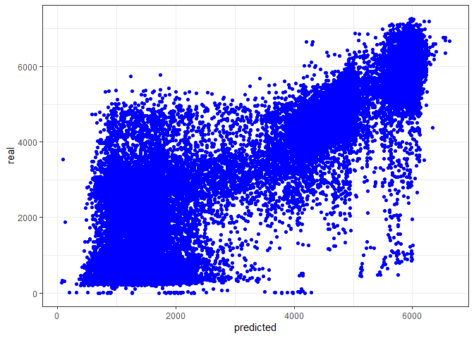
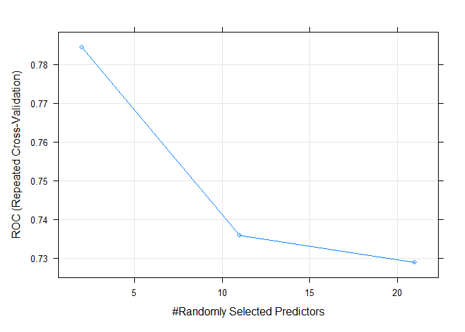

---
title: "Machine Learning I - Regression - Presentation"
author: "<font size=5><b>- Mateusz Domaradzki&Karol Ziolo</b></font>"
output:
  html_document:
    toc: yes
    keep_md: yes
    toc_depth: 3
    toc_float: yes
    theme: united
    highlight: tango
  pdf_document:
    toc: yes
    toc_depth: '3'
---


<br>
<br><br>
<br><br>
<br><br>


# Regression

<br><br>

## Data Preparation


<br>

### Weather

<br>

<font size=5>We decided to use only weather_general, without detailed verson of it. Thus, we merged some of the levels</font>


```r
data$weather_general <- as.factor(data$weather_general)

data$weather_general[data$weather_general == "Maze"] <- "Fog"
data$weather_general[data$weather_general == "Haze"] <- "Smoke"
data$weather_general[data$weather_general == "Squall"] <- "Thunderstorm"
```


|Variable     |  Frequency|
|:------------|-----:|
|Clear        |  8020|
|Clouds       | 10163|
|Drizzle      |   919|
|Fog          |   481|
|Mist         |  3491|
|Rain         |  3558|
|Smoke        |   760|
|Snow         |  1794|
|Thunderstorm |   501|
<br>


### Our transformations

<br>
<font size=5>Using barplots we noticed that the hour is highly correlated with the level of traffic</font>
<br>


```r
time_of_the_day<-function(x) {
  result<-list()
  if(x>=6 & x<=8){
    result<-"Traffic_morning_peak_hour"
  } 
  else if(x>8 & x<15){
    result<-"Working_hours"}
  else if(x>=15 & x<=17){
    result<-"Traffic_evening_peak_hour"}
  else{
    result <-"night"}
  return(result)
}
```
<br>

<font size=5>Also the season matters in interactions</font>


```r
season_of_the_year <- function(x) {
  result<-list()
  if(x=='11' || x=='12' || x=='01'){
    result<-"Winter"
  } 
  else if(x=='07' || x=='08' || x=='09' ){
    result<-"Summer_Holidays"}
  else{
    result <-"The_Rest_of_the_season"}
  return(result)
}
```
<br>

<font size=5>The day of the week is also an important factor</font>


```r
day_of_the_wk<- function(x) {
  result<-list()
  if(x=='sobota' || x=='niedziela'){
    result<-"Weekend"
  } 
  else{
    result <-"Working_day"}
  return(result)
}
```
<br>


<br>

### Final data

<font size=5>Our final data looks like that</font>
<font size=4>
<ul>
  <li>We decided to drop cloud_coverage due to 0 correlation with traffic. </li> 
  <li>Rain_mm and snow_mm occur so rarely that we won't use them, as we have weather_general which suggest the weather conditions.</li>
  <li>We dropped some outliers</li>
</ul> 
</font>

<br>


| traffic|weather_general | temperature|season                 |day2        |hour2                     |
|-------:|:---------------|-----------:|:----------------------|:-----------|:-------------------------|
|     508|Clear           |        11.5|The_Rest_of_the_season |Working_day |night                     |
|     323|Clear           |        10.3|The_Rest_of_the_season |Working_day |night                     |
|     274|Clear           |         8.0|The_Rest_of_the_season |Working_day |night                     |
|     372|Clear           |         7.9|The_Rest_of_the_season |Working_day |night                     |
|     812|Clear           |         6.4|The_Rest_of_the_season |Working_day |night                     |
|    2720|Clear           |         5.5|The_Rest_of_the_season |Working_day |night                     |
|    5674|Clear           |         5.1|The_Rest_of_the_season |Working_day |Traffic_morning_peak_hour |
|    6512|Clear           |         5.0|The_Rest_of_the_season |Working_day |Traffic_morning_peak_hour |
|    5473|Clear           |         9.3|The_Rest_of_the_season |Working_day |Working_hours             |
|    5096|Clear           |        18.8|The_Rest_of_the_season |Working_day |Working_hours             |
|    4887|Clear           |        20.1|The_Rest_of_the_season |Working_day |Working_hours             |
|    5335|Clear           |        21.2|The_Rest_of_the_season |Working_day |Working_hours             |
|    5699|Clear           |        22.0|The_Rest_of_the_season |Working_day |Traffic_evening_peak_hour |
|    6130|Clear           |        22.0|The_Rest_of_the_season |Working_day |Traffic_evening_peak_hour |
|    4620|Clouds          |        20.5|The_Rest_of_the_season |Working_day |night                     |
|    3594|Clouds          |        17.5|The_Rest_of_the_season |Working_day |night                     |
|    2895|Clouds          |        15.0|The_Rest_of_the_season |Working_day |night                     |
|    2643|Clear           |        14.0|The_Rest_of_the_season |Working_day |night                     |
|    1783|Clear           |        13.1|The_Rest_of_the_season |Working_day |night                     |
|    1017|Clear           |        12.1|The_Rest_of_the_season |Working_day |night                     |


## Best algorithm 

### What we tried?

<br>

<font size=4>
<ul>
  <li>OLS </li> 
  <li>LASSO </li>
  <li>RIDGE </li>
  <li>Elastic approach between them </li>
  <li>KNN </li>
  <li>SVR </li>
</ul> 
</font>

<br>

### The best algorithm - SVR

<br>


```r
ctrl_cv5 <- trainControl(method = "cv",
                         number = 5)

parametersC_sigma2 <- 
  expand.grid(C = 415,
              sigma = 0.1)


svm_Radial2 <- train(traffic~. + weather_general*hour2  + day2*hour2 + weather_general*day2, 
                            data = data_final, 
                            method = "svmRadial",
                            tuneGrid = parametersC_sigma2,
                            trControl = ctrl_cv5)
```

<br>

### Plot real data/predicted data

<br>
<!-- -->

### EXPECTED MAPE

<font size=4> Im going to apply MAPE from a R package MLmetrics </font>


```
## [1] 2.169793
```

<br>

# Classification

<br>

## Data Exploration


### General outlook on data

<br>

<font size=4> Let read the data. </font>

<br>

### Age

<font size=4> We decided to merge groups "55-64" and "65+" into one group called "55+" to be more representative. </font>

<br>


```r
data2$age[data2$age=="55-64"] <- "55+"
data2$age[data2$age == "65+"] <- "55+"

data2$age = factor(data2$age, levels = c("18-24",
                                         "25-34",
                                         "35-44",
                                         "45-54",
                                         "55+"),ordered = TRUE)

data2$age <- droplevels(data2$age)
```


<br>

### Education

<font size=4> The education variable is divided into many levels, which is not distributed evenly. We have many disproportions so we decided to merge people who left school at or before 18 into one group. </font>

<br>


```r
data2$education[data2$education %in% c("Left school before 16 years",
                                       "Left school at 16 years",
                                       "Left school at 17 years",
                                       "Left school at 18 years")] <- "Left school at or before 18"

data2$education = factor(data2$education, levels = c("Left school at or before 18",
                                                     "Some college or university, no certificate or degree",
                                                     "Professional certificate/ diploma",
                                                     "University degree",
                                                     "Masters degree",
                                                     "Doctorate degree"),
                         ordered = TRUE)
data2$education <- droplevels(data2$education)
```

### Country

<font size=4> There is small number of people from Canada and Ireland so we decided to assign them to the group of others. </font>

<br>


```r
data2$country[data2$country %in% c("Canada","Ireland")] <- "Other"
```

<br>

### Ethnicity

<font size=4> Thus, we decided to drop Ethnicity because it does not provide any reliable information regarding other ethnic groups. </font>

<br>


<br>

### Consumption

<font size=4> We decided to downgrade consumption variables into three groups: "regularly", "occasionally" and "never". We also dropped "Consumption Chocolate" and "Consumption Caffeine".  </font>

<br>


```r
# Vector of consumption variables which concern us 
consumption_variables = c("consumption_alcohol", "consumption_amphetamines", 
                          "consumption_cannabis", "consumption_mushrooms", 
                          "consumption_nicotine")
# Grouping function
fun = 
  function(x){
  if (x %in% c("never used","used over a decade ago","used in last decade")){
    x = "never"}
  else if (x %in% c("used in last year","used in last month")){
    x = "occasionally"}
  else if (x %in% c("used in last week","used in last day")){ 
    x = "regularly"}
  }

# Applying grouping function
data2[consumption_variables] = unlist(lapply(data2[consumption_variables], function(y) lapply(y, fun)))

# Modifying into factors
data2[consumption_variables] = lapply(data2[consumption_variables], 
                                     function(x) factor(x, levels = c("never","occasionally","regularly"),ordered = TRUE))

# Dropping "Consumption Chocolate" and "Consumption Caffeine" variables
data2 = data2[,-c(14,16)]
```

<br>

### Personality Variables

<font size=4> Checking for outliers. </font>

<br>


```r
min_max = matrix(1:14,nrow = 7, ncol = 2)
colnames(min_max) = c("Minimum", "Maximum")
rownames(min_max) = names(which(sapply(data2,is.numeric)))
min_max[,1] = apply(data2[names(which(sapply(data2,is.numeric)))],2, min)
min_max[,2] = apply(data2[names(which(sapply(data2,is.numeric)))],2, max)
kable(min_max)
```


|                              | Minimum| Maximum|
|:-----------------------------|-------:|-------:|
|personality_neuroticism       |       0|     100|
|personality_extraversion      |       0|     100|
|personality_openness          |       0|     100|
|personality_agreeableness     |       0|     100|
|personality_conscientiousness |       0|     100|
|personality_impulsiveness     |       0|     100|
|personality_sensation         |       0|     100|

<br>

<font size=4> We decided to aggregate personality variables and create one called "personality". </font>

<br>


```r
data2["personality"] =  
  colnames(data2[sapply(data2,is.numeric)])[apply(data2[sapply(data2,is.numeric)],1,which.max)]

data2$personality = as.factor(data2$personality)
```

<br>

### Dependent Variable


```r
kable(table(data2$consumption_cocaine_last_month))
```


|Var1 | Freq|
|:----|----:|
|No   | 1373|
|Yes  |  127|

```r
data2$consumption_cocaine_last_month = factor(data2$consumption_cocaine_last_month, levels = c("No","Yes"), ordered = TRUE)

data2 = data2[sapply(data2,is.factor)]
```

<br>

### Statistical Tests


```r
chisqr = matrix(1:10,nrow = 10, ncol = 1)
colnames(chisqr) = c("p-value")
rownames(chisqr) = names(which(sapply(data2,is.factor)))
chisqr[,1] = apply(data2[names(which(sapply(data2,is.factor)))],2, 
                   function(x) round(chisq.test(x, data2$consumption_cocaine_last_month,correct=FALSE)$p.value,4))
```

```
## Warning in chisq.test(x, data2$consumption_cocaine_last_month, correct = FALSE):
## Chi-squared approximation may be incorrect
```

```r
kable(chisqr)
```


|                               | p-value|
|:------------------------------|-------:|
|age                            |  0.0000|
|gender                         |  0.0003|
|education                      |  0.0736|
|consumption_alcohol            |  0.0040|
|consumption_amphetamines       |  0.0000|
|consumption_cannabis           |  0.0000|
|consumption_mushrooms          |  0.0000|
|consumption_nicotine           |  0.0000|
|consumption_cocaine_last_month |  0.0000|
|personality                    |  0.0000|

```r
data2 = data2[,-3]
data2$education
```

```
## NULL
```

<br>

## Best algorithm 

### What we tried?

<br>

<font size=4>
<ul>
  <li>Logistic </li> 
  <li>KNN </li>
  <li>SVM </li>
  <li>Random Forest </li>
</ul> 
</font>

<br>

### The best algorithm - RF


```r
options(contrasts = c("contr.treatment",  # for non-ordinal factors
                      "contr.treatment")) # for ordinal factors
set.seed(9432398) # We specify random seed

# Train control with cross-validation
ctrl_cv5 <- trainControl(method = "repeatedcv",
                         number = 5,
                         classProbs = TRUE,
                         summaryFunction = twoClassSummary,
                         repeats = 3)

ctrl_cv5$sampling = "up"

data2_rf_train <- 
  train(consumption_cocaine_last_month ~ .,
        data2,        
        method = "rf",
        metric = "ROC",
        trControl = ctrl_cv5)

plot(data2_rf_train)
```

<!-- -->

### Balanced Accuracy


```r
rf_fitted = predict(data2_rf_train, data2)
rf_results = summary_binary_class(predicted_classes = rf_fitted,
                     real = data2$consumption_cocaine_last_month)
balanced_accuracy=confusionMatrix(as.factor(rf_fitted), data2$consumption_cocaine_last_month)$byClass[11]
kable(balanced_accuracy)
```


|                  |         x|
|:-----------------|---------:|
|Balanced Accuracy | 0.8411835|

<font size=5><b> Our expected Balanced Accuracy for test dataset equals 83.04%</b></font>

